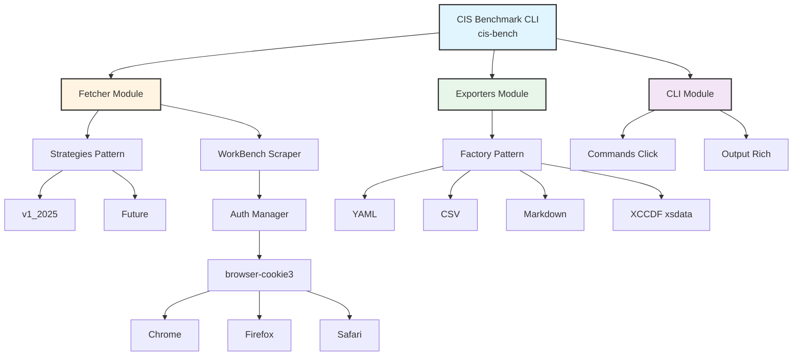
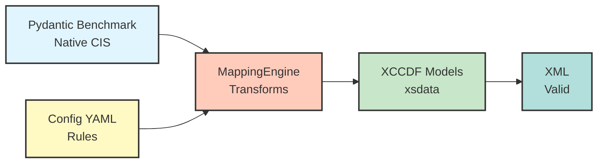
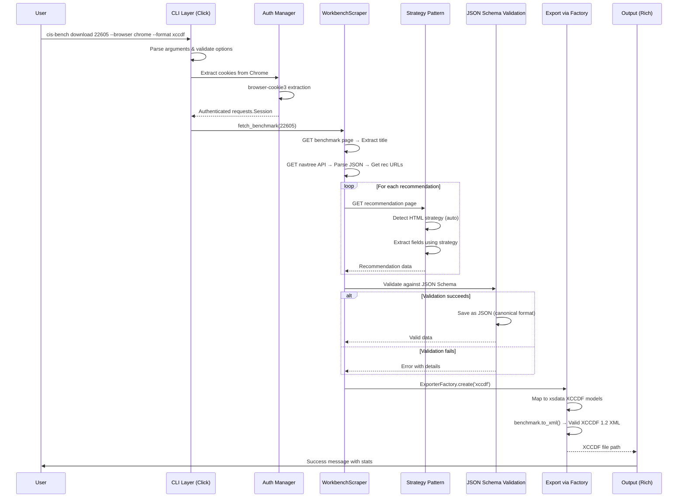
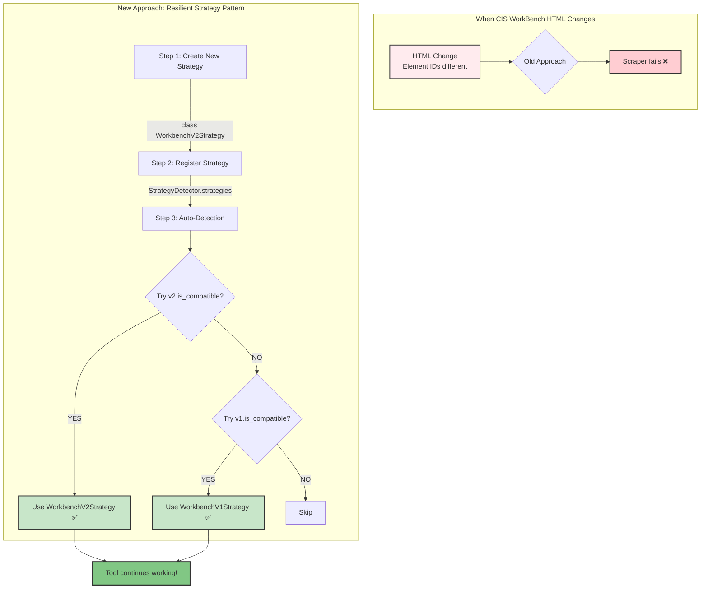
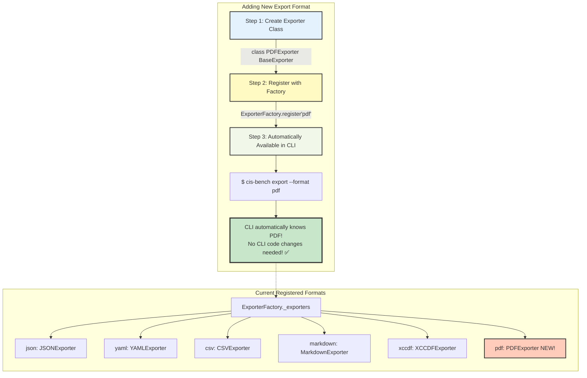
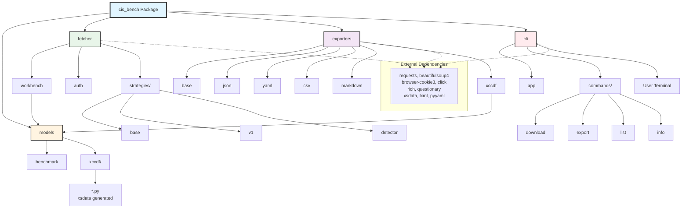
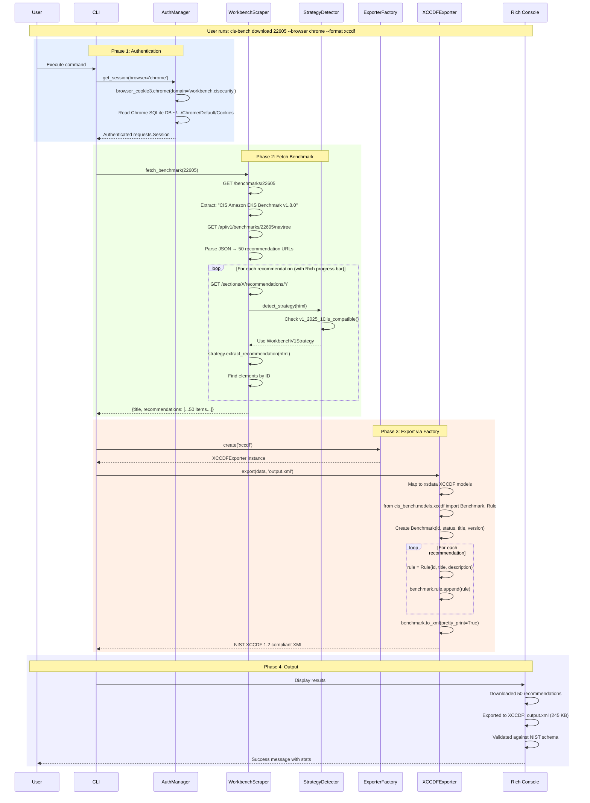
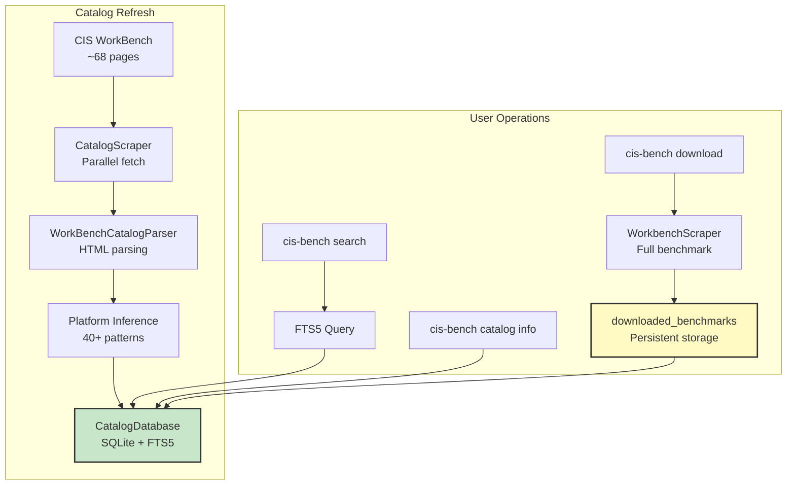

# CIS Benchmark CLI - Architecture and Implementation Plan

## Project Vision

**CIS Benchmark CLI** - A comprehensive command-line tool for fetching, managing, converting, and analyzing CIS benchmarks from CIS WorkBench.

### What It Is

- **Primary**: CLI tool for downloading CIS benchmarks
- **Secondary**: Format converter (JSON YAML/CSV/Markdown/XCCDF)
- **Future**: Benchmark analysis, diff, compliance checking

### What It is NOT (Yet)

- Not a compliance scanner
- Not a benchmark authoring tool
- Not a remediation tool

## Current State vs Target State

### Current State (v0.1-alpha)
```
Single-directory scripts:

- fetch.py (monolithic scraper)
- cli.py (basic commands)
- exporter.py (hand-rolled XML)
- Not installable
- Not schema-compliant
```

### Target State (v1.0)
```
Professional Python package:

- Installable: pip install cis-benchmark-cli
- CLI: cis-bench command available system-wide
- Schema-compliant XCCDF export
- Extensible architecture
- Well-tested
- Well-documented
```

## Architecture

### Visual Overview

#### Component Architecture



#### Configuration-Based XCCDF Mapping Layer

The CIS Benchmark CLI employs a configuration-driven approach to XCCDF mapping, allowing flexibility and adaptability as security frameworks and conventions evolve. Rather than hard-coding field mappings and transformations directly in the codebase, mapping logic is externalized into versioned YAML configuration files.

**Why Configuration-Based Mapping?**

- Mappings evolve as security frameworks change
- Different organizations may require different output styles
- Adjust mappings without code changes
- Version control for mapping conventions
- Clear separation of concerns

**Architecture Flow:**


**Available Configurations:**

- `configs/disa_style.yaml` - DISA STIG-compatible (CCI, VulnDiscussion, etc.)
- `configs/cis_native_style.yaml` - Clean CIS-centric (separate rationale, metadata)

**Configuration Structure:**
```yaml
field_mappings:
 title:
 target_element: "title"
 source_field: "title"
 transform: "strip_html"

 description: # Complex mapping
 target_element: "description"
 structure: "embedded_xml_tags"
 components:

 - tag: "VulnDiscussion"
 sources: ["description", "rationale"]

cci_deduplication:
 enabled: true
 algorithm: "use_cci_where_available"
```

**Benefits:**

- No hard-coded mappings
- Easy to adjust conventions
- Versioned (v1.0, v2.0)
- Testable configurations
- Extensible for custom styles

See: `docs/MAPPING_ENGINE_DESIGN.md` for complete specification

**XCCDF Version Handling:**

- DISA style: Uses XCCDF 1.1.4 (what real STIGs use)
 - Simple IDs allowed: `CIS-6_1_1`, `CIS-6_1_1_rule`
 - Models: `cis_bench/models/xccdf_v1_1/`
- CIS Native style: Uses XCCDF 1.2 (modern standard)
 - Pattern IDs required: `xccdf_org.cisecurity_rule_*`
 - Models: `cis_bench/models/xccdf/`
- Config specifies version: `xccdf_version: "1.1.4"` or `"1.2"`
- MappingEngine loads appropriate models automatically

**DISA Conventions:**

- Documented: `schemas/disa_conventions/v1.10.0.yaml`
- Reverse-engineered from RHEL 9 + Ubuntu 24.04 STIGs
- Specifies required elements, order, CCI format, etc.
- Version-tracked for DISA evolution

#### Data Flow with JSON Schema (Canonical Format)



#### Strategy Pattern Flow (HTML Adaptation)



#### Factory Pattern Flow (Export Formats)



#### Package Dependency Graph



#### Complete Workflow Sequence



#### Strategy Pattern in Action

```
Scenario: CIS WorkBench updates HTML (element IDs change)
═══════════════════════════════════════════════════════════════

BEFORE (Old element IDs):
 <div id="description-recommendation-data">...</div>

AFTER (New structure):
 <div class="recommendation-description" data-field="desc">...</div>

─────────────────────────────────────────────────────────────────

Our Response:

1. Create new strategy file:
 ┌──────────────────────────────────────────────────┐
 │ cis_bench/fetcher/strategies/v2_2026_01.py │
 │ │
 │ class WorkbenchV2Strategy(ScraperStrategy): │
 │ version = "v2_2026_01" │
 │ │
 │ selectors = { │
 │ "description": { │
 │ "class": "recommendation-description" │
 │ } │
 │ } │
 │ │
 │ def is_compatible(self, html): │
 │ # Check for new structure markers │
 │ return 'recommendation-description' in html│
 └────────────────────────────────────────────────── ┘

2. Register in detector:
 ┌──────────────────────────────────────────────────┐
 │ strategies/detector.py │
 │ │
 │ _strategies = [ │
 │ WorkbenchV2Strategy(), # NEW (highest) │
 │ WorkbenchV1Strategy(), # OLD (fallback) │
 │ ] │
 └──────────────────────────────────────────────────┘

3. Tool automatically adapts:
 ┌──────────────────────────────────────────────────┐
 │ User runs: cis-bench download 22605 │
 │ │
 │ StrategyDetector checks: │
 │ ├─ v2.is_compatible(html)? YES │
 │ └─ Use WorkbenchV2Strategy │
 │ │
 │ Download succeeds! No user action needed! │
 └──────────────────────────────────────────────────┘

4. Old benchmarks still work:
 ┌──────────────────────────────────────────────────┐
 │ Downloading archived benchmark (old HTML): │
 │ │
 │ StrategyDetector checks: │
 │ ├─ v2.is_compatible(html)? NO │
 │ ├─ v1.is_compatible(html)? YES │
 │ └─ Use WorkbenchV1Strategy │
 │ │
 │ Still works! Backward compatible! │
 └──────────────────────────────────────────────────┘

Time to fix when HTML changes: 15-30 minutes

 - Create new strategy class
 - Test compatibility detection
 - Deploy
```

#### XCCDF Generation Flow (xsdata)

```mermaid
graph TB
    subgraph "One-Time Setup"
        A[1. Download NIST schema]
        B[2. Generate Python models]
        C[3. Result: Python dataclasses<br/>with XML serialization]

        A --> |xccdf_1.2.xsd from csrc.nist.gov| B
        B --> |$ xsdata xccdf_1.2.xsd<br/>--package cis_bench.models.xccdf| C

        C --> D[@dataclass<br/>class Benchmark:<br/>id, status, title, version, rule]
        D --> E[def to_xml: Auto-generated serialization]
    end

    subgraph "Runtime Usage"
        F[Import xsdata models]
        G[Create schema-compliant objects]
        H[Add rules auto-validated]
        I[Export to XML]

        F --> |from cis_bench.models.xccdf<br/>import Benchmark, Rule, Status| G
        G --> |benchmark = Benchmark<br/>id, status, title, version| H

        H --> |for rec in recommendations:<br/>rule = Rule<br/>benchmark.rule.append| I
        I --> |xml_output = benchmark.to_xml<br/>pretty_print=True| J[Valid XCCDF 1.2 XML]
    end

    E -.-> F

    subgraph "Validation"
        J --> K[$ xmllint --schema xccdf_1.2.xsd output.xml]
        K --> L[output.xml validates ✅]
        L --> M[Compatible with:<br/>OpenSCAP, SCAP Compliance Checker<br/>Nessus, Any XCCDF 1.2 tool]
    end

    style A fill:#e3f2fd,stroke:#333,stroke-width:2px
    style C fill:#c8e6c9,stroke:#333,stroke-width:2px
    style J fill:#fff9c4,stroke:#333,stroke-width:2px
    style L fill:#81c784,stroke:#333,stroke-width:3px
    style M fill:#a5d6a7,stroke:#333,stroke-width:2px
```

#### Catalog System (Local Database)

The catalog system provides fast, searchable access to 1,300+ CIS benchmarks with platform filtering and full-text search. It uses SQLite with SQLModel (Pydantic + SQLAlchemy) for type-safe operations.

**Why a Local Database?**

- **Fast search**: FTS5 full-text search is <1ms vs network requests
- **Offline access**: Browse available benchmarks without network
- **Platform filtering**: Discover benchmarks by category (cloud, os, database, container)
- **Downloaded content storage**: Preserve benchmark JSON for instant re-export
- **Scriptable**: JSON/CSV output for automation

**Architecture Flow:**



**Database Schema:**

```
┌─────────────────────────────────────────────────────────────────────┐
│                         CATALOG DATABASE                             │
│                    ~/.cis-bench/catalog.db                          │
├─────────────────────────────────────────────────────────────────────┤
│                                                                      │
│  ┌──────────────────┐     ┌──────────────────┐                      │
│  │ catalog_benchmarks│     │ downloaded_      │                      │
│  ├──────────────────┤     │ benchmarks       │                      │
│  │ benchmark_id (PK)│◄────┤ benchmark_id (FK)│                      │
│  │ title            │     │ content_json     │  ← Full benchmark    │
│  │ version          │     │ content_hash     │    data (persistent) │
│  │ url              │     │ downloaded_at    │                      │
│  │ status_id (FK)   │     │ recommendation_  │                      │
│  │ platform_id (FK) │     │   count          │                      │
│  │ community_id (FK)│     └──────────────────┘                      │
│  │ owner_id (FK)    │                                               │
│  │ platform_type    │  ← Inferred (cloud, os, database, container)  │
│  │ published_date   │                                               │
│  │ is_latest        │                                               │
│  └────────┬─────────┘                                               │
│           │                                                          │
│  ┌────────┴─────────────────────────────────────────┐               │
│  │                   LOOKUP TABLES                   │               │
│  │  ┌─────────────┐ ┌─────────────┐ ┌─────────────┐ │               │
│  │  │ platforms   │ │ communities │ │ owners      │ │               │
│  │  │ platform_id │ │ community_id│ │ owner_id    │ │               │
│  │  │ name        │ │ name        │ │ username    │ │               │
│  │  └─────────────┘ └─────────────┘ └─────────────┘ │               │
│  │  ┌─────────────┐ ┌─────────────┐                 │               │
│  │  │ benchmark_  │ │ collections │                 │               │
│  │  │ statuses    │ │ collection_ │                 │               │
│  │  │ status_id   │ │   id        │                 │               │
│  │  │ name        │ │ name        │                 │               │
│  │  └─────────────┘ └─────────────┘                 │               │
│  └──────────────────────────────────────────────────┘               │
│                                                                      │
│  ┌──────────────────────────────────────────────────┐               │
│  │              FULL-TEXT SEARCH (FTS5)              │               │
│  │  benchmarks_fts                                   │               │
│  │  ├─ benchmark_id (UNINDEXED)                     │               │
│  │  ├─ title                                        │               │
│  │  ├─ platform                                     │               │
│  │  ├─ community                                    │               │
│  │  └─ description                                  │               │
│  │  tokenize='porter unicode61'                     │               │
│  └──────────────────────────────────────────────────┘               │
│                                                                      │
│  ┌──────────────────────────────────────────────────┐               │
│  │              METADATA                             │               │
│  │  scrape_metadata                                  │               │
│  │  ├─ key (PK)                                     │               │
│  │  ├─ value                                        │               │
│  │  └─ updated_at                                   │               │
│  │  Keys: last_full_scrape, total_pages_scraped    │               │
│  └──────────────────────────────────────────────────┘               │
└─────────────────────────────────────────────────────────────────────┘
```

**Two Types of Data:**

| Data Type | Location | Rebuildable? | Purpose |
|-----------|----------|--------------|---------|
| **Catalog metadata** | `catalog_benchmarks` | Yes (scrape again) | Index of all CIS benchmarks from WorkBench listing pages |
| **Downloaded benchmarks** | `downloaded_benchmarks` | Expensive (re-download each) | Full benchmark JSON with all recommendations |

This distinction is critical: catalog metadata is a cache that can be rebuilt with `cis-bench catalog refresh`, but downloaded benchmarks represent user data that should be preserved across schema upgrades.

**Schema Migrations (Alembic):**

Because downloaded benchmarks are persistent user data, schema changes must be handled via migrations:

```
alembic/
├── alembic.ini          # Alembic configuration
├── env.py               # Migration environment
├── script.py.mako       # Migration template
└── versions/
    └── e8d458b69e97_add_platform_type_column.py
```

**When to use migrations:**

- Adding new columns (e.g., `platform_type` for filtering)
- Changing relationships between tables
- Adding new tables
- Any schema change that affects existing user databases

**Migration workflow:**

```bash
# Create migration after changing models
alembic revision --autogenerate -m "Add new column"

# Apply migrations (user's database)
alembic upgrade head
```

**Platform Inference:**

Benchmarks are automatically categorized from titles using 40+ patterns:

```python
PLATFORM_PATTERNS = [
    # Cloud (check before OS to catch "Oracle Cloud" before "Oracle Linux")
    (["oracle cloud", "oci"], "cloud", "oracle-cloud"),
    (["amazon web services", "aws"], "cloud", "aws"),
    (["google cloud", "gcp"], "cloud", "google-cloud"),
    (["microsoft azure", "azure"], "cloud", "azure"),

    # Databases (check before OS to catch "Oracle Database")
    (["oracle database", "oracle db"], "database", "oracle-database"),
    (["mysql"], "database", "mysql"),
    (["postgresql"], "database", "postgresql"),

    # Operating Systems
    (["ubuntu"], "os", "ubuntu"),
    (["red hat", "rhel"], "os", "red-hat"),
    (["windows server"], "os", "windows-server"),

    # Containers
    (["kubernetes", "k8s"], "container", "kubernetes"),
    (["docker"], "container", "docker"),
    (["eks"], "container", "aws-eks"),
    # ... 40+ total patterns
]
```

**Catalog Module Structure:**

```
cis_bench/catalog/
├── __init__.py
├── database.py      # CatalogDatabase class (CRUD, search, stats)
├── models.py        # SQLModel models (CatalogBenchmark, Platform, etc.)
├── parser.py        # WorkBenchCatalogParser (HTML → dict)
├── scraper.py       # CatalogScraper (parallel page fetching)
├── search.py        # Search utilities
├── downloader.py    # Benchmark download integration
└── schema.sql       # Reference SQL schema
```

**Key Classes:**

- `CatalogDatabase`: Main interface for all database operations
- `CatalogScraper`: Scrapes 68 pages from WorkBench (parallel, rate-limited)
- `WorkBenchCatalogParser`: Extracts benchmark metadata from HTML tables
- SQLModel models: Type-safe ORM with Pydantic validation

**Performance:**

- Full catalog refresh: ~2 minutes (parallel scraping)
- FTS5 search: <1ms
- Platform filtering: <10ms
- Database size: ~5MB for 1,300+ benchmarks

### High-Level Design Principles

1. **Separation of Concerns**: Fetching, parsing, exporting, CLI are separate
2. **SOLID Principles**: Single responsibility, Open/Closed, Dependency injection
3. **Factory Pattern**: Exporters are pluggable
4. **Schema-First**: Use official NIST XCCDF schema (xsdata generated)
5. **Testability**: All components independently testable
6. **Extensibility**: Easy to add new formats, sources, features

### Package Structure

```
cis-benchmark-cli/
├── cis_bench/ # Main package (renamed for clarity)
│ ├── __init__.py # Package version, exports
│ │
│ ├── models/ # Data models
│ │ ├── __init__.py
│ │ ├── benchmark.py # Internal benchmark data model (dataclasses)
│ │ ├── schema.json # JSON Schema - OUR CANONICAL FORMAT
│ │ └── xccdf/ # XCCDF schema models (xsdata generated)
│ │ ├── __init__.py
│ │ └── xccdf_1_2.py # Generated from NIST XSD
│ │
│ ├── fetcher/ # Downloading/scraping CIS WorkBench
│ │ ├── __init__.py
│ │ ├── workbench.py # CIS WorkBench scraper (uses strategies)
│ │ ├── auth.py # Cookie management (browser-cookie3)
│ │ ├── http.py # HTTP session wrapper
│ │ └── strategies/ # Scraper strategies (HTML version adapters)
│ │ ├── __init__.py
│ │ ├── base.py # ScraperStrategy ABC
│ │ ├── detector.py # StrategyDetector (auto-select)
│ │ ├── v1_current.py # Current HTML version (2025-10)
│ │ └── config/ # Optional: YAML configs for selectors
│ │ └── workbench_v1.yaml
│ │
│ ├── exporters/ # Export to different formats
│ │ ├── __init__.py
│ │ ├── base.py # BaseExporter (ABC), ExporterFactory
│ │ ├── json.py # JSON exporter (our native format)
│ │ ├── yaml.py # YAML exporter
│ │ ├── csv.py # CSV exporter
│ │ ├── markdown.py # Markdown exporter
│ │ └── xccdf.py # XCCDF exporter (uses xsdata models)
│ │
│ ├── catalog/ # Catalog database system
│ │ ├── __init__.py
│ │ ├── database.py # CatalogDatabase (CRUD, search)
│ │ ├── models.py # SQLModel models
│ │ ├── parser.py # HTML parser for catalog pages
│ │ ├── scraper.py # Parallel catalog scraper
│ │ ├── search.py # Search utilities
│ │ ├── downloader.py # Download integration
│ │ └── schema.sql # Reference SQL schema
│ │
│ ├── utils/ # Shared utilities
│ │ ├── __init__.py
│ │ ├── logging.py # Logging setup
│ │ └── validation.py # Data validation helpers
│ │
│ └── cli/ # CLI interface
│ ├── __init__.py
│ ├── app.py # Main Click app
│ ├── commands/ # Command modules
│ │ ├── __init__.py
│ │ ├── download.py # Download command
│ │ ├── export.py # Export command
│ │ ├── list.py # List command
│ │ └── info.py # Info command
│ └── output.py # Rich console output helpers
│
├── alembic/ # Database migrations
│ ├── alembic.ini # Alembic configuration
│ ├── env.py # Migration environment
│ ├── script.py.mako # Migration template
│ └── versions/ # Migration scripts
│ └── *.py # Individual migrations
│
├── tests/ # Test suite
│ ├── __init__.py
│ ├── test_fetcher.py
│ ├── test_exporters.py
│ ├── test_xccdf_schema_compliance.py
│ ├── test_cli.py
│ └── fixtures/
│ ├── sample_navtree.json
│ ├── sample_recommendation.html
│ └── expected_xccdf.xml
│
├── scripts/ # Development/build scripts
│ ├── generate_xccdf_models.sh # Regenerate XCCDF models from XSD
│ └── download_schemas.sh # Download NIST schemas
│
├── docs/ # Documentation
│ ├── README.md # User documentation
│ ├── ARCHITECTURE.md # This file
│ ├── CLAUDE.md # Developer guide for Claude Code
│ ├── CONTRIBUTING.md # Contribution guidelines
│ └── examples/ # Usage examples
│ ├── basic_usage.md
│ └── advanced_usage.md
│
├── setup.py # Package installation
├── requirements.txt # Runtime dependencies
├── requirements-dev.txt # Development dependencies
├── pytest.ini # Pytest configuration
├── .gitignore
└── LICENSE # Apache 2.0 License
```

### Component Design

#### 1. Models

**Purpose**: Define data structures

```python
# benchmark.py
@dataclass
class Recommendation:
 ref: str
 title: str
 description: Optional[str]
 rationale: Optional[str]
 audit: Optional[str]
 remediation: Optional[str]
 # ... other fields

@dataclass
class Benchmark:
 title: str
 version: str
 recommendations: List[Recommendation]
 metadata: Dict[str, Any]
```

**XCCDF Models**: Auto-generated from NIST schema using xsdata

- Type-safe
- Schema-compliant
- Bi-directional XML ↔ Python

#### 2. Fetcher (Strategy Pattern for HTML Changes)

**Purpose**: Download benchmarks from CIS WorkBench with adaptable scraping strategies

**Problem**: CIS WorkBench HTML structure can change, breaking our selectors

**Solution**: Strategy pattern + configuration-based selectors

```python
# strategies/base.py
class ScraperStrategy(ABC):
 """Base class for scraper strategies (different HTML versions)."""

 @property
 @abstractmethod
 def version(self) -> str:
 """Strategy version identifier."""
 pass

 @property
 @abstractmethod
 def selectors(self) -> dict:
 """CSS/XPath selectors for this HTML version."""
 pass

 @abstractmethod
 def extract_recommendation(self, html: str) -> dict:
 """Extract recommendation data from HTML."""
 pass

 def is_compatible(self, html: str) -> bool:
 """Check if this strategy works with given HTML."""
 # Look for version indicators in HTML
 pass

# strategies/v1_current.py
class WorkbenchV1Strategy(ScraperStrategy):
 """Current CIS WorkBench HTML structure (as of 2025-10)."""

 version = "v1_2025_10"

 selectors = {
 "assessment": {"id": "automated_scoring-recommendation-data"},
 "description": {"id": "description-recommendation-data"},
 "rationale": {"id": "rationale_statement-recommendation-data"},
 # ... other selectors
 }

 def extract_recommendation(self, html: str) -> dict:
 soup = BeautifulSoup(html, 'html.parser')
 data = {}

 for field, selector in self.selectors.items():
 if 'id' in selector:
 elem = soup.find(id=selector['id'])
 elif 'class' in selector:
 elem = soup.find(class_=selector['class'])
 elif 'xpath' in selector:
 # Use lxml for XPath
 elem = soup.xpath(selector['xpath'])

 data[field] = elem.decode_contents().strip() if elem else None

 return data

 def is_compatible(self, html: str) -> bool:
 # Check for known element that only exists in this version
 soup = BeautifulSoup(html, 'html.parser')
 return soup.find(id="automated_scoring-recommendation-data") is not None

# strategies/factory.py
class StrategyDetector:
 """Auto-detects and selects the correct scraper strategy."""

 strategies = [
 WorkbenchV1Strategy(),
 # WorkbenchV2Strategy(), # Add when site changes
 # WorkbenchLegacyStrategy(), # Fallback for old benchmarks
 ]

 @classmethod
 def detect_strategy(cls, html: str) -> ScraperStrategy:
 """Auto-detect which strategy to use."""
 for strategy in cls.strategies:
 if strategy.is_compatible(html):
 logger.info(f"Using scraper strategy: {strategy.version}")
 return strategy

 raise ValueError("No compatible scraper strategy found. CIS WorkBench HTML may have changed.")

 @classmethod
 def register_strategy(cls, strategy: ScraperStrategy):
 """Register custom strategy (for testing or new versions)."""
 cls.strategies.insert(0, strategy) # Prepend (check newest first)

# workbench.py
class WorkbenchScraper:
 def __init__(self, session: requests.Session, strategy: ScraperStrategy = None):
 self.session = session
 self.strategy = strategy # Allow manual override
 self._detected_strategy = None

 def fetch_recommendation(self, rec_url: str) -> dict:
 """Fetch single recommendation with auto-strategy detection."""
 html = self._fetch_html(rec_url)

 # Auto-detect strategy on first fetch (or use override)
 if not self._detected_strategy and not self.strategy:
 self._detected_strategy = StrategyDetector.detect_strategy(html)

 strategy = self.strategy or self._detected_strategy
 return strategy.extract_recommendation(html)

 def fetch_benchmark(self, benchmark_id: str) -> Benchmark:
 """Fetch complete benchmark."""
 pass

 def fetch_navtree(self, benchmark_id: str) -> dict:
 """Fetch navigation tree."""
 pass

# auth.py
class AuthManager:
 @staticmethod
 def get_session(browser: str = None,
 cookies_file: str = None) -> requests.Session:
 """Get authenticated session."""
 pass
```

**Configuration File Support** (Optional Enhancement):

```yaml
# ~/.cis-bench/scrapers/workbench_v1.yaml
version: "v1_2025_10"
name: "CIS WorkBench Current"
compatibility_check:
 element_id: "automated_scoring-recommendation-data"

selectors:
 assessment:
 type: id
 value: "automated_scoring-recommendation-data"
 description:
 type: id
 value: "description-recommendation-data"
 rationale:
 type: id
 value: "rationale_statement-recommendation-data"
 impact:
 type: id
 value: "impact_statement-recommendation-data"
 audit:
 type: id
 value: "audit_procedure-recommendation-data"
 remediation:
 type: id
 value: "remediation_procedure-recommendation-data"
 default_value:
 type: id
 value: "default_value-recommendation-data"
 artifact_eq:
 type: id
 value: "artifact_equation-recommendation-data"
 mitre_mapping:
 type: id
 value: "mitre_mappings-recommendation-data"
 references:
 type: id
 value: "references-recommendation-data"
```

**Benefits**:

- **When HTML changes**: Create new strategy, register it
- **Auto-detection**: Automatically uses correct strategy
- **Override**: Can force specific strategy for testing
- **Versioned**: Track which HTML version we're scraping
- **Configurable**: Selectors in config files (optional)
- **Extensible**: Easy to add new strategies
- **Debuggable**: Know which strategy is being used

#### 3. Exporters (Factory Pattern)

**Purpose**: Convert benchmarks to various formats

```python
# base.py
class BaseExporter(ABC):
 @abstractmethod
 def export(self, benchmark: Benchmark, output_path: str) -> str:
 """Export benchmark to file. Returns output path."""
 pass

 @abstractmethod
 def get_file_extension(self) -> str:
 """Get default file extension for this format."""
 pass

class ExporterFactory:
 _exporters = {
 'json': JSONExporter,
 'yaml': YAMLExporter,
 'csv': CSVExporter,
 'markdown': MarkdownExporter,
 'xccdf': XCCDFExporter,
 }

 @classmethod
 def create(cls, format_type: str) -> BaseExporter:
 """Create exporter for given format."""
 if format_type not in cls._exporters:
 raise ValueError(f"Unsupported format: {format_type}")
 return cls._exporters[format_type]()

 @classmethod
 def register(cls, format_type: str, exporter_class: Type[BaseExporter]):
 """Register custom exporter (for plugins)."""
 cls._exporters[format_type] = exporter_class

# xccdf.py
class XCCDFExporter(BaseExporter):
 def export(self, benchmark: Benchmark, output_path: str) -> str:
 # Use xsdata-generated models
 from cis_bench.models.xccdf import Benchmark as XCCDFBenchmark
 from cis_bench.models.xccdf import Rule, Status

 xccdf = XCCDFBenchmark(
 id="cis_benchmark",
 status=[Status(value="draft")],
 # ... map our data to XCCDF models
 )

 # xsdata handles XML serialization
 xml_output = xccdf.to_xml()
 with open(output_path, 'w') as f:
 f.write(xml_output)

 return output_path
```

#### 4. CLI

**Purpose**: User interface

```python
# app.py
@click.group()
@click.version_option(version='1.0.0')
@click.option('--verbose', '-v', is_flag=True)
def cli(verbose):
 """CIS Benchmark CLI - Fetch and manage CIS benchmarks."""
 setup_logging(verbose)

# commands/download.py
@cli.command()
@click.argument('benchmark_ids', nargs=-1)
@click.option('--browser', type=click.Choice(['chrome', 'firefox', 'edge', 'safari']))
@click.option('--output-dir', '-o', default='./benchmarks')
@click.option('--format', '-f', multiple=True, default=['json'])
def download(benchmark_ids, browser, output_dir, format):
 """Download CIS benchmarks."""
 # Use Rich progress bars
 # Use WorkbenchScraper
 # Use ExporterFactory for each format
 pass
```

## Detailed Implementation Order

### Phase 1: Foundation and Schema Generation (45-60 min)

**Goal**: Set up proper package structure with XCCDF models

1. **Install xsdata**
 ```bash
 pip install xsdata[cli]
 ```

2. **Generate XCCDF models from NIST schema**
 ```bash
 # Download XSD
 curl -o xccdf_1.2.xsd https://csrc.nist.gov/schema/xccdf/1.2/xccdf_1.2.xsd

 # Generate Python models
 xsdata xccdf_1.2.xsd --package cis_bench.models.xccdf
 ```

3. **Create package structure**
 ```bash
 mkdir -p cis_bench/{models/xccdf,fetcher,exporters,cli/commands,utils}
 touch cis_bench/__init__.py
 # ... create all __init__.py files
 ```

4. **Create base exporter pattern**

 - `cis_bench/exporters/base.py` - BaseExporter ABC
 - `cis_bench/exporters/__init__.py` - ExporterFactory

5. **Move existing code into new structure**

 - `fetch.py` `cis_bench/fetcher/workbench.py`
 - `cookies_manager.py` `cis_bench/fetcher/auth.py`

### Phase 2: Implement Exporters (45 min)

**Goal**: All exporters using factory pattern, XCCDF using xsdata

6. **Implement each exporter**

 - JSON (simple, native format)
 - YAML (using PyYAML)
 - CSV (using csv module)
 - Markdown (template-based)
 - **XCCDF (using xsdata models)**

7. **Test each exporter**

 - Unit tests with fixtures
 - XCCDF validation against schema

### Phase 3: CLI Refactor (45 min)

**Goal**: Professional CLI with all commands

8. **Refactor CLI to use new architecture**

 - Split commands into separate modules
 - Use Rich for all output
 - Implement download with progress bars

9. **Create setup.py**
 ```python
 setup(
 name='cis-benchmark-cli',
 version='1.0.0',
 packages=find_packages(),
 entry_points={
 'console_scripts': [
 'cis-bench=cis_bench.cli.app:cli',
 ],
 },
 )
 ```

10. **Test installation**
 ```bash
 pip install -e .
 cis-bench --help
 ```

### Phase 4: Testing and Documentation (45 min)

**Goal**: Production-ready quality

11. **Write tests**

 - Unit tests for each component
 - Integration tests for CLI
 - XCCDF schema validation tests

12. **Update documentation**

 - README.md with examples
 - CLAUDE.md with architecture
 - Inline docstrings

13. **End-to-end testing**

 - Download benchmark
 - Export to all formats
 - Validate XCCDF output

## Future Capabilities (Post v1.0)

### v1.1 - Enhanced Management

- `cis-bench diff <bench1> <bench2>` - Compare benchmarks
- `cis-bench search <keyword>` - Search within benchmarks
- `cis-bench merge <bench1> <bench2>` - Merge benchmarks

### v1.2 - Analysis

- `cis-bench analyze <benchmark>` - Benchmark statistics
- `cis-bench validate <xccdf>` - Validate XCCDF against schema
- `cis-bench report <benchmark>` - Generate HTML reports

### v1.3 - Integration

- `cis-bench import <file>` - Import from other formats
- `cis-bench sync <source>` - Sync from multiple sources
- API server mode for CI/CD integration

### v2.0 - Compliance

- Integration with scanning tools (InSpec, SCAP)
- Compliance mapping (CIS NIST 800-53, etc.)
- Benchmark customization/tailoring

## Design Decisions and Rationale

### Why xsdata over manual XML?

- Schema compliance guaranteed
- Type safety
- Automatic validation
- Less code to maintain
- Bi-directional (can read XCCDF too in future)

### Why Factory Pattern for exporters?

- Easy to add new formats
- Plugin architecture (register custom exporters)
- Testable in isolation
- Clean separation of concerns

### Why separate CLI commands into modules?

- Each command is independently testable
- Easier to maintain
- Can be extended by plugins
- Clear ownership

### Why browser-cookie3 over manual cookies?

- Better UX (no manual cookie export)
- Works on all platforms
- Automatic cookie refresh

## Success Criteria

### v1.0 Must Have

- Installable via pip
- `cis-bench` command works system-wide
- Download benchmarks from CIS WorkBench
- Export to JSON, YAML, CSV, Markdown, **XCCDF**
- XCCDF validates against NIST schema
- Progress bars for downloads
- Unit tests for core components
- Documentation (README, inline docs)

### v1.0 Nice to Have

- Interactive mode with questionary
- Config file support (.cis-bench.yaml)
- Comprehensive logging
- Integration tests

## Technical Debt to Avoid

 **Don't**:

- Mix concerns (fetching in exporters, etc.)
- Hard-code paths or URLs
- Skip error handling
- Ignore schema validation
- Skip tests for "later"
- Use global state

 **Do**:

- Use dependency injection
- Handle errors gracefully
- Log appropriately
- Validate inputs
- Write tests as you go
- Use type hints

## Tools and Technologies

### Runtime Dependencies

- **click**: CLI framework
- **rich**: Terminal styling, progress bars
- **questionary**: Interactive prompts
- **requests**: HTTP client
- **beautifulsoup4**: HTML parsing
- **browser-cookie3**: Browser cookie extraction
- **pyyaml**: YAML export
- **xsdata[cli]**: XCCDF models generation
- **lxml**: XML processing (required by xsdata)
- **sqlmodel**: SQLite ORM (Pydantic + SQLAlchemy)
- **alembic**: Database migrations

### Development Dependencies

- **pytest**: Testing framework
- **pytest-mock**: Mocking
- **ruff**: Linting and formatting
- **bandit**: Security scanning
- **mypy**: Type checking

## Naming Conventions

### Package: `cis-benchmark-cli` (PyPI)

- Hyphenated for pip
- Clear, descriptive name
- Not too long

### Module: `cis_bench` (Python)

- Underscore for Python import
- Short, memorable
- Professional

### CLI Command: `cis-bench`

- Hyphenated for CLI
- Tab-completable
- Clear namespace

### Commands:

- `cis-bench download` - Fetch benchmarks
- `cis-bench export` - Convert formats
- `cis-bench list` - Show downloaded benchmarks
- `cis-bench info` - Show benchmark details
- `cis-bench search` - Search catalog (FTS5)
- `cis-bench catalog refresh` - Update catalog from WorkBench
- `cis-bench catalog platforms` - List platform categories
- `cis-bench catalog stats` - Show catalog statistics
- `cis-bench get` - Search + download + export in one command
- Future: `diff`, `analyze`, `validate`, etc.

---

**Version**: 0.3.1
**Author**: MITRE SAF Team
**Last Updated**: December 2025
**Status**: Beta
