# Architecture

!!! info "Documentation Path"
**You are here:** Developer Guide > Architecture Overview

- **For detailed pipeline:** See [Data Flow Pipeline](data-flow-pipeline.md)
- **For MappingEngine:** See [MappingEngine User Guide](mapping-engine-guide.md)
- **For practical examples:** See [Workflows](../user-guide/workflows.md)

## System Overview

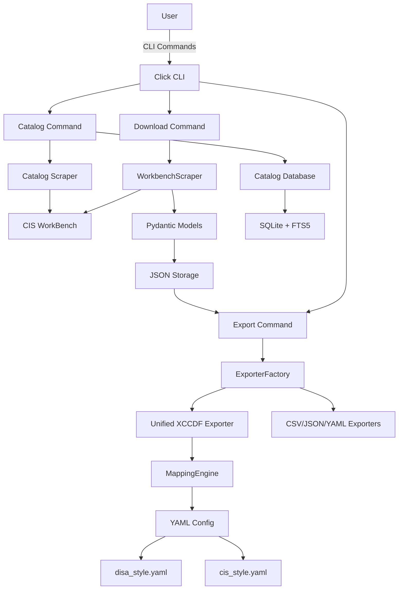

---

## Core Components

### CLI Layer

**Framework:** Click
**Entry Point:** `src/cis_bench/cli/app.py`

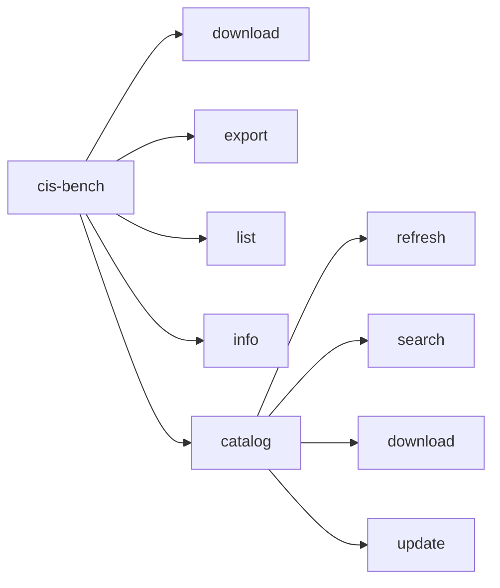

**Commands:**

- `download` - Fetch benchmarks from WorkBench
- `export` - Convert to formats (JSON, YAML, CSV, MD, XCCDF)
- `list` - Show downloaded benchmarks
- `info` - Display benchmark details
- `catalog` - Manage catalog (8 subcommands)

---

### Fetcher Layer

**Purpose:** Download and parse benchmarks from CIS WorkBench

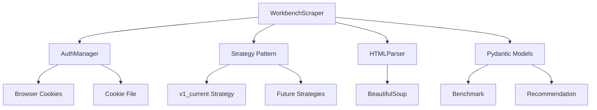

**Components:**

- `WorkbenchScraper` - Main scraper class
- `AuthManager` - Cookie extraction
- `Strategy Pattern` - Adapts to HTML changes
- `HTMLParser` - Extract data from HTML

**Output:** Validated Pydantic models (19 fields per recommendation)

---

### Export Layer - Config-Driven Architecture

**Key Innovation:** ONE exporter class, multiple styles via YAML config

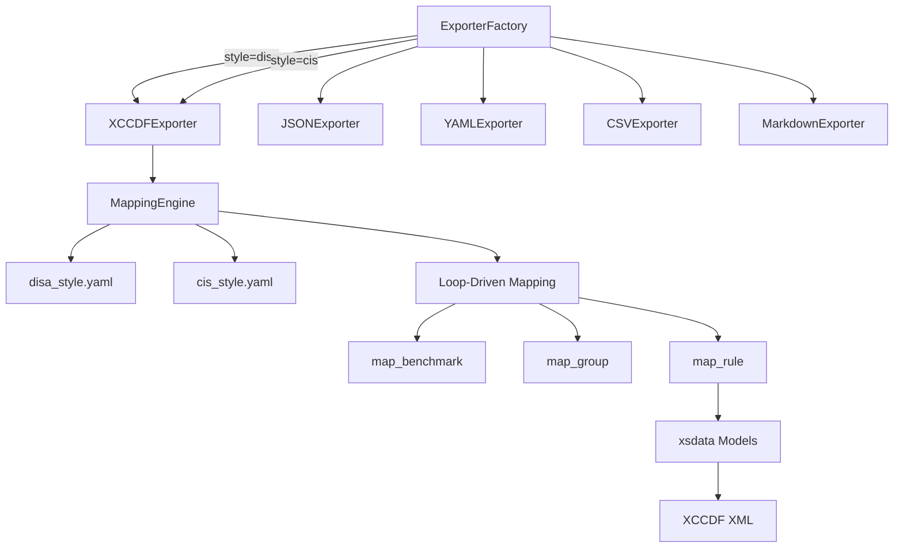

**Factory Pattern:**
```python
# Create exporter with style parameter
exporter = ExporterFactory.create("xccdf", style="cis")

# Adding new style: just create YAML config
# pci_dss_style.yaml -> ExporterFactory.create("xccdf", style="pci-dss")
```

---

### MappingEngine - The Heart of XCCDF Export

**Config-Driven Transformation:**

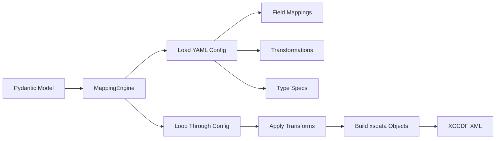

**Key Principle:** **Changes happen in YAML, not code**

**Example - Adding a new field:**

```yaml
# In cis_style.yaml
field_mappings:
new_field:
target_element: "custom-element"
source_field: "my_data"
transform: "html_to_markdown"
```

**No Python code changes needed!**

**Loop-Driven Methods:**

- `map_rule()` - Loops through `field_mappings` config
- `map_group()` - Loops through `group_elements` config
- `map_benchmark()` - Loops through `benchmark` config

---

### Catalog System

**Purpose:** Browse and discover 1300+ CIS benchmarks

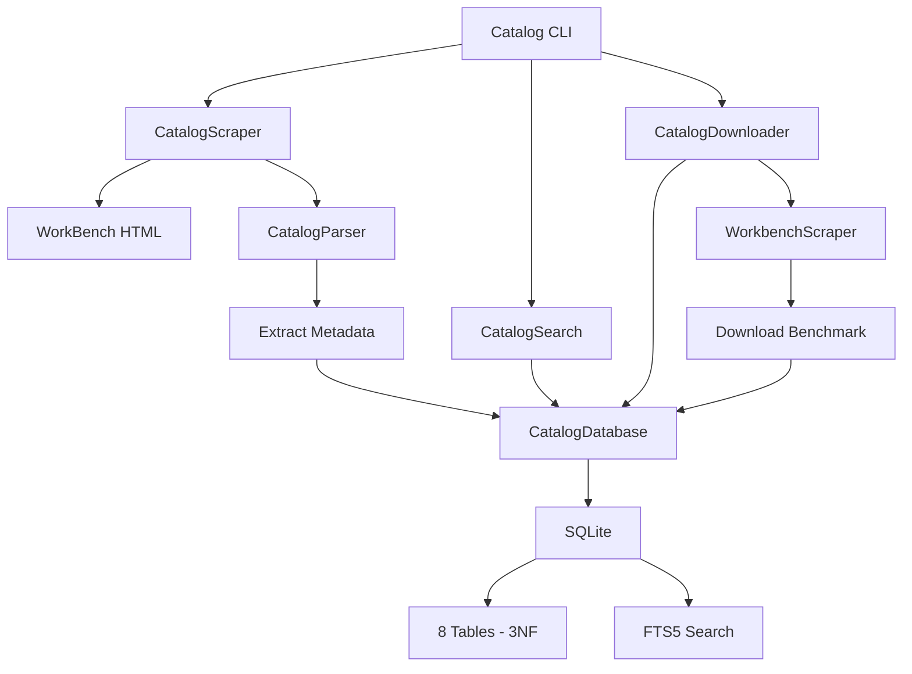

**Database Schema (3NF):**

- `platforms` - Operating System, Cloud, Database
- `benchmark_statuses` - Published, Draft, Archived
- `communities` - Development communities
- `collections` - Categories/tags
- `owners` - Authors
- `catalog_benchmarks` - Main table with FKs
- `downloaded_benchmarks` - Cached content
- `scrape_metadata` - Tracking

**FTS5 Search:**

- Fuzzy matching ("ubunt" finds "ubuntu")
- Multi-word search
- Ranked results (BM25)
- Fast (<1ms for 1000+ records)

---

## Data Flow

### Download Workflow

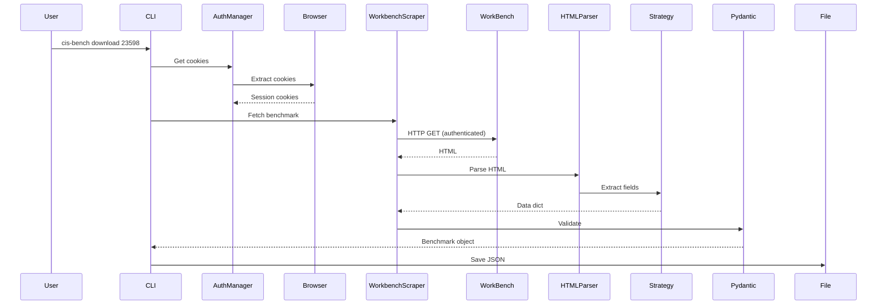

### Export Workflow

```mermaid
sequenceDiagram
User->>CLI: cis-bench export --format xccdf --style cis
CLI->>ExporterFactory: create("xccdf", style="cis")
ExporterFactory-->>CLI: XCCDFExporter(cis)
CLI->>XCCDFExporter: export(benchmark)
XCCDFExporter->>MappingEngine: Load cis_style.yaml
MappingEngine->>Config: Read field_mappings
MappingEngine->>Loop: For each field in config
Loop->>Transform: Apply transformation
Transform->>xsdata: Build typed objects
xsdata->>XML: Serialize
XCCDFExporter->>PostProcessor: Inject metadata
PostProcessor-->>XCCDFExporter: Final XML
XCCDFExporter->>File: Write XCCDF
```

### Catalog Workflow

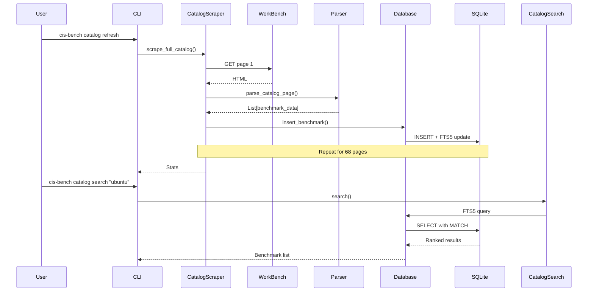

---

## Design Patterns

### Strategy Pattern (Fetcher)

**Problem:** CIS WorkBench HTML changes over time

**Solution:** Version-specific strategies

```python
class StrategyDetector:
strategies = [
v1_2025_10, # Current
v1_2024_06, # Older
]

def detect(html):
for strategy in strategies:
if strategy.can_handle(html):
return strategy
```

**Adding new HTML format:**
1. Create new strategy class
2. Register with detector
3. Old benchmarks still work

### Factory Pattern (Exporters)

**Problem:** Multiple export formats

**Solution:** Pluggable exporters

```python
ExporterFactory.register("xccdf", XCCDFExporter)
ExporterFactory.register("csv", CSVExporter)

# Create exporter
exporter = ExporterFactory.create("xccdf", style="cis")
```

**Adding new format:**
1. Create exporter class
2. Register with factory
3. Available in CLI

### Config-Driven Mapping (XCCDF)

**Problem:** Multiple XCCDF styles with different structures

**Solution:** YAML-based configuration

```yaml
# cis_style.yaml
field_mappings:
title:
target_element: "title"
source_field: "title"
transform: "strip_html"

cis_controls_metadata:
structure: "metadata_from_config"
requires_post_processing: true
```

**Adding new XCCDF style:**
1. Create `style_name_style.yaml`
2. Define field mappings
3. Use: `--format xccdf --style style_name`

**No code changes!**

---

## Technology Stack

**Core:**

- Python 3.8+
- Click (CLI framework)
- Pydantic (data validation)
- SQLModel (database ORM)

**Scraping:**

- requests (HTTP)
- BeautifulSoup4 (HTML parsing)
- browser-cookie3 (authentication)

**Export:**

- xsdata (XCCDF models from XSD)
- lxml (XML processing)
- PyYAML (config files)

**Database:**

- SQLite (catalog storage)
- SQLAlchemy (via SQLModel)
- FTS5 (full-text search)

**CLI/UX:**

- Rich (formatting, progress bars)
- questionary (interactive prompts)

**Development:**

- pytest (testing)
- ruff (linting/formatting)
- bandit (security)
- pre-commit (hooks)
- mkdocs-material (documentation)

---

## File Organization

```
src/cis_bench/
├── cli/ # Click commands
│ ├── app.py # Main CLI
│ └── commands/ # Command modules
├── fetcher/ # WorkBench scraper
│ ├── workbench.py # Main scraper
│ ├── auth.py # Authentication
│ └── strategies/ # HTML strategies
├── exporters/ # Format exporters
│ ├── base.py # Factory
│ ├── xccdf_unified_exporter.py # Config-driven XCCDF
│ ├── mapping_engine.py # YAML XCCDF
│ ├── configs/ # YAML configs
│ └── [format]_exporter.py
├── catalog/ # Catalog system
│ ├── database.py # SQLModel database
│ ├── models.py # Database models
│ ├── scraper.py # Multi-page scraper
│ ├── parser.py # HTML parser
│ ├── search.py # Search/filter
│ └── downloader.py # Smart download
├── models/ # Data models
│ ├── benchmark.py # Pydantic models
│ ├── cis_controls_official.py
│ ├── enhanced_metadata.py
│ └── xccdf/ # xsdata generated
├── utils/ # Utilities
│ ├── xml_utils.py # XCCDF processing
│ ├── html_parser.py # HTML cleaning
│ ├── logging_config.py # Logging setup
│ └── ...
├── validators/ # XCCDF validators
└── config.py # Environment config
```

---

## Configuration System

### Environment-Based Config

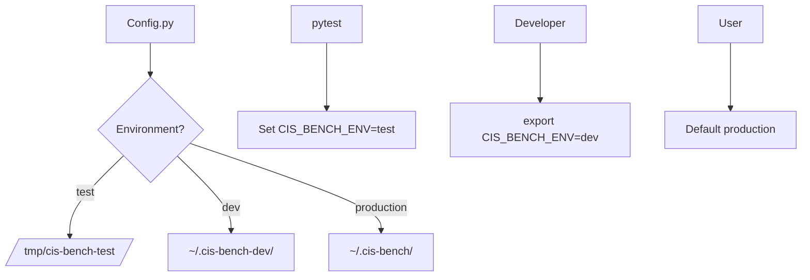

**Environment variable:** `CIS_BENCH_ENV`

- `test` - Pytest (automatic)
- `dev` - Development work
- `production` - Default

**Optional .env file:**
```bash
# ~/.cis-bench/.env
CIS_BENCH_ENV=dev
CIS_BENCH_SSL_VERIFY=false
```

Loaded automatically via python-dotenv.

---

## YAML Mapping System

### How Styles Work

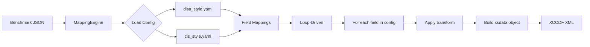

### YAML Structure

```yaml
# Style metadata
metadata:
style_name: "cis"
xccdf_version: "1.2"

# Field mappings (loop-driven)
field_mappings:

# Simple field
title:
target_element: "title"
source_field: "title"
transform: "strip_html"

# Complex nested structure
cis_controls_metadata:
target_element: "metadata"
structure: "metadata_from_config"
requires_post_processing: true

# Multiple values
reference:
target_element: "reference"
multiple: true
structure: "dublin_core"
source_field: "nist_controls"

# Transformations
transformations:
strip_html:
function: "HTMLCleaner.strip_html"

html_to_markdown:
function: "HTMLCleaner.html_to_markdown"
```

### Structure Types

**Supported structures:**

- `simple` - Direct field mapping
- `nested` - Parent with child elements
- `dublin_core` - Reference with DC metadata
- `metadata_from_config` - Generic nested XML (CIS Controls, hierarchies)
- `ident_from_list` - Generic ident generation (CCIs, MITRE, PCI-DSS)
- `embedded_xml_tags` - VulnDiscussion style

**Adding new structure:**
1. Define in YAML with `structure: "new_type"`
2. Add handler in MappingEngine
3. OR use existing structure types

---

## Database Schema

### Catalog Database (SQLite)

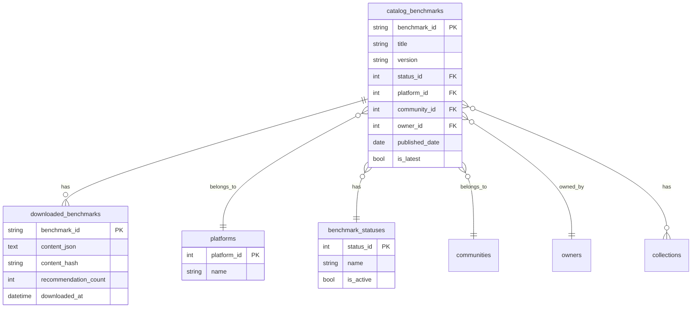

**3NF Normalization:**

- No data duplication
- Referential integrity via FKs
- Fast queries with indexes

**FTS5 Virtual Table:**
```sql
CREATE VIRTUAL TABLE benchmarks_fts USING fts5(
benchmark_id UNINDEXED,
title,
platform,
community,
description,
tokenize='porter unicode61'
);
```

Provides fuzzy full-text search.

---

## Extensibility Points

### Adding New Export Format

1. Create exporter class:
```python
class NewFormatExporter(BaseExporter):
def export(self, benchmark, output_path):
# Convert and write
pass
```

2. Register:
```python
ExporterFactory.register("newformat", NewFormatExporter)
```

3. Use:
```bash
cis-bench export benchmark.json --format newformat
```

### Adding New XCCDF Style

1. Create YAML config:
```yaml
# custom_style.yaml
metadata:
style_name: "custom"
xccdf_version: "1.2"

field_mappings:
# Define mappings
```

2. Use:
```bash
cis-bench export benchmark.json --format xccdf --style custom
```

**No code changes needed!**

### Adding New Scraper Strategy

1. Create strategy class:
```python
class V2Strategy(BaseStrategy):
def can_handle(self, html):
# Detection logic
pass

def extract_fields(self, html):
# Extraction logic
pass
```

2. Register with detector

3. Automatically selected when HTML changes

---

## Testing Architecture

### Test Organization

```
tests/
├── unit/ # Fast, isolated tests
├── integration/ # Component integration tests
└── e2e/ # CLI command tests
```

### Test Isolation

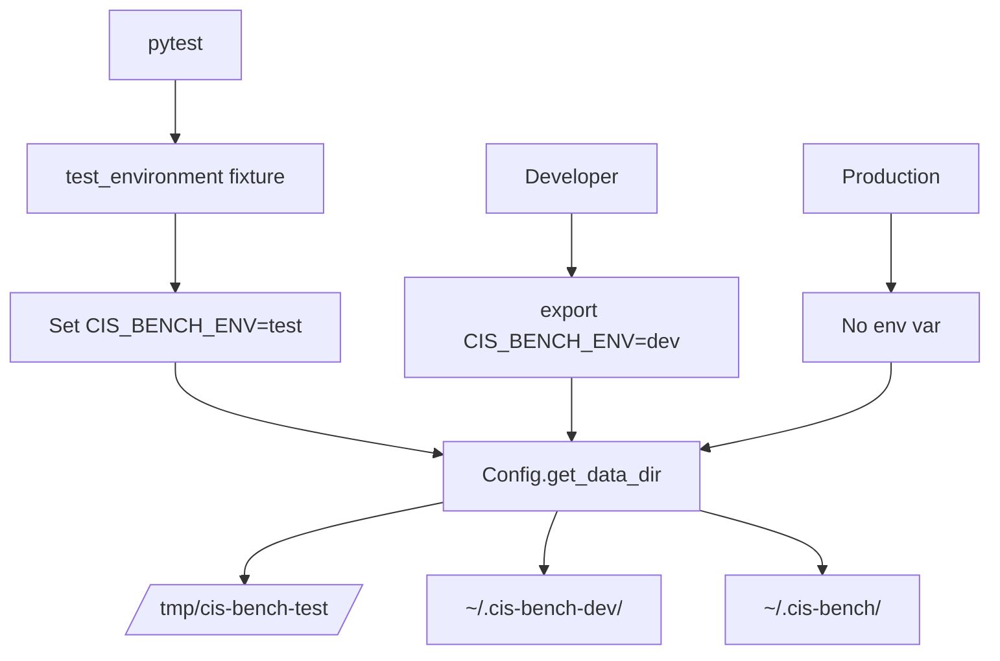

**Automatic isolation:**

- pytest sets `CIS_BENCH_ENV=test`
- All tests use `/tmp/cis-bench-test/`
- Production data never touched

**405 tests** across all layers, all properly isolated.

---

## See Also

- [Mapping Engine Design](../technical-reference/MAPPING_ENGINE_DESIGN.md) - Detailed config system
- [YAML Config Reference](../technical-reference/YAML_CONFIG_REFERENCE.md) - Complete YAML syntax
- [Data Model](../technical-reference/DATA_MODEL.md) - Pydantic models
- [Testing Guide](TESTING.md) - Testing best practices
