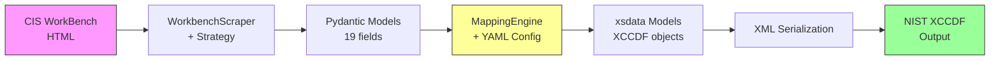
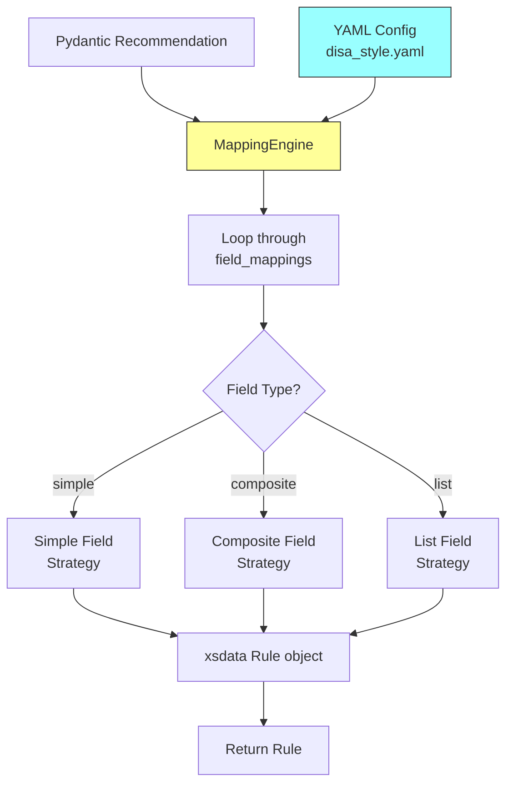

# Data Flow Pipeline

**Complete transformation pipeline from CIS WorkBench HTML to NIST XCCDF XML**

!!! tip "New to these terms?"
See the [Glossary](../about/glossary.md) for definitions of technical terms used in this guide (Strategy, Pydantic, xsdata, MappingEngine, etc.)

---

## Overview

This document explains the complete end-to-end data transformation that happens when you run:

```bash
cis-bench download 23598
cis-bench export 23598 --format xccdf --style cis
```

**The Journey:**


Each stage performs specific transformations, validates data, and handles errors. Let's trace through each step with real data.

---

## Stage 1: HTML Extraction

**Input:** CIS WorkBench [benchmark](../about/glossary.md#benchmark) page HTML
**Component:** `WorkbenchScraper` + [`ScraperStrategy`](../about/glossary.md#strategy)
**Output:** Python dictionaries with extracted data

### How It Works

When you run `cis-bench download 23598`, the system:

1. **Authenticates** using saved [session](../about/glossary.md#session) from `~/.cis-bench/session.cookies`
2. **Fetches HTML** from `https://workbench.cisecurity.org/benchmarks/23598`
3. **Detects HTML version** using `StrategyDetector`
4. **Applies [strategy](../about/glossary.md#strategy)** (currently `v1_current.py`) to parse HTML
5. **Extracts 19 fields** per [recommendation](../about/glossary.md#recommendation)

### Strategy Pattern

```python
# src/cis_bench/fetcher/strategies/v1_current.py

class V1CurrentStrategy(ScraperStrategy):
def extract_recommendation(self, html_section):
"""Extract single recommendation from HTML."""
return {
'ref': self._extract_ref(html_section),
'title': self._extract_title(html_section),
'description': self._extract_description(html_section),
'rationale': self._extract_rationale(html_section),
# ... 15 more fields
}
```

**Why Strategy Pattern?**
CIS WorkBench updates HTML structure periodically. When this happens:
1. Create new strategy class (e.g., `v2_january2026.py`)
2. Detector auto-selects based on HTML structure
3. Old benchmarks still work with old strategy
4. No changes to core scraper code

### Example: Extracting CIS Controls

**HTML Input:**
```html
<div class="cis-controls">
<strong>CIS Controls v8:</strong>
<ul>
<li>4.1 - Establish and Maintain a Secure Configuration Process (IG1)</li>
<li>4.8 - Uninstall or Disable Unnecessary Services (IG2)</li>
</ul>
</div>
```

**Extraction Logic:**
```python
def _extract_cis_controls(self, section):
controls_div = section.find('div', class_='cis-controls')
controls = []
for li in controls_div.find_all('li'):
text = li.get_text()
# Parse: "4.1 - Title (IG1)" {id: "4.1", title: "...", ig: "IG1"}
controls.append(parse_control(text))
return controls
```

**Python Output:**
```python
{
'cis_controls': [
{'id': '4.1', 'title': '...', 'ig': 'IG1'},
{'id': '4.8', 'title': '...', 'ig': 'IG2'}
]
}
```

### All 19 Extracted Fields

| Field | Source | Transformation |
|-------|--------|----------------|
| ref | Title heading | Extract number |
| title | Title heading | Strip HTML, clean |
| url | Recommendation URL | Construct from ID |
| description | Description section | Parse HTML, preserve structure |
| rationale | Rationale section | Parse HTML |
| impact | Impact statement | Parse HTML |
| audit | Audit procedure | Parse code blocks |
| remediation | Remediation section | Parse code blocks |
| default_value | Default value section | Parse text |
| additional_info | Additional info | Parse HTML |
| references | External references | Extract links |
| assessment_status | Assessment badge | Extract text (Automated/Manual) |
| profiles | Profile tags | Parse badges (Level 1/2, Server/Workstation) |
| cis_controls | CIS Controls v8 section | Parse list structured data |
| mitre_mapping | MITRE section | Parse techniques, tactics, mitigations |
| nist_controls | NIST section | Parse control IDs |
| artifacts | Audit scripts | Extract code blocks |
| scored | Scoring badge | Boolean |
| tags | Metadata tags | Extract keywords |

---

## Stage 2: Pydantic Validation

**Input:** Python dictionaries from scraper
**Component:** `Benchmark` and `Recommendation` Pydantic models
**Output:** Validated, typed Python objects

### Validation Layer

```python
# src/cis_bench/models/benchmark.py

class Recommendation(BaseModel):
"""Single CIS recommendation with validation."""

ref: str = Field(..., description="Recommendation number (e.g., 1.1.1)")
title: str = Field(..., min_length=1, description="Title")
url: HttpUrl = Field(..., description="WorkBench URL")
assessment_status: Optional[str] = Field(None, pattern="^(Automated|Manual)$")
profiles: List[str] = Field(default_factory=list)

# Content fields
description: Optional[str] = None
rationale: Optional[str] = None
audit: Optional[str] = None
remediation: Optional[str] = None

# Compliance mappings (structured)
cis_controls: List[Dict[str, Any]] = Field(default_factory=list)
mitre_mapping: Optional[Dict[str, Any]] = None
nist_controls: List[str] = Field(default_factory=list)

@field_validator('ref')
@classmethod
def validate_ref_format(cls, v):
"""Ensure ref matches CIS numbering (e.g., 1.1.1)."""
if not re.match(r'^\d+(\.\d+)*$', v):
raise ValueError(f"Invalid ref format: {v}")
return v
```

### What Validation Catches

**Before Pydantic:**
```python
{
'ref': '1.1.1 (extra text)', # Invalid format
'title': '', # Empty
'url': 'not-a-url', # Invalid URL
'assessment_status': 'Auto' # Should be "Automated"
}
```

**After Pydantic (validated):**
```python
Recommendation(
ref='1.1.1', # Validated format
title='Ensure mounting of cramfs...', # Required, non-empty
url=HttpUrl('https://...'), # Validated URL
assessment_status='Automated', # Enum validated
profiles=['Level 1 - Server'], # Structured list
cis_controls=[{...}], # Structured data
mitre_mapping={...} # Validated dict
)
```

### Why Pydantic?

1. **Type safety** - Catch data quality issues early
2. **Validation** - Ensures fields meet requirements
3. **Serialization** - Easy JSON export
4. **Documentation** - Schema auto-generated
5. **IDE support** - Autocomplete, type hints

---

## Stage 3: Configuration-Driven Mapping

**Input:** Pydantic `Recommendation` objects
**Component:** `MappingEngine` + YAML configuration files
**Output:** xsdata XCCDF objects (not yet serialized)

### The MappingEngine



### How Configuration Works

**YAML Configuration (disa_style.yaml):**
```yaml
field_mappings:
# Simple field mapping
title:
target_element: "title"
source_field: "title"
transform: "strip_html"
xccdf_type: "TextType"

# Composite field mapping
description:
target_element: "description"
structure: "embedded_xml_tags"
components:

- tag: "VulnDiscussion"
sources:

- field: "description"
transform: "strip_html"

- field: "rationale"
transform: "strip_html"
separator: "\n\n"

- tag: "FalsePositives"
sources:

- field: "additional_info"
transform: "strip_html"
xccdf_type: "HtmlTextWithSubType"

# List field with CCI lookup
ident:
target_element: "ident"
structure: "list"
cci_lookup:
source_field: "nist_controls"
extract: "primary" # or "all"
system_uri: "http://cyber.mil/cci"
```

### Mapping Process (Step-by-Step)

**Step 1: Load Configuration**
```python
config = load_yaml_config('disa_style.yaml')
engine = MappingEngine(config)
```

**Step 2: Loop Through Field Mappings**
```python
for field_name, field_config in config['field_mappings'].items():
strategy = FieldMappingStrategy.create(field_config)
value = strategy.apply(recommendation, field_config)
xccdf_rule[field_name] = value
```

**Step 3: Apply Transformations**
```python
# Transform: "strip_html"
input: "<p>Disable <code>cramfs</code> filesystem</p>"
output: "Disable cramfs filesystem"

# Transform: "strip_html_keep_code"
input: "<p>Run: <code>modprobe -n -v cramfs</code></p>"
output: "Run: `modprobe -n -v cramfs`"

# Transform: "safe_field"
input: recommendation.get('rationale') # Might be None
output: "" if None else cleaned_value
```

**Step 4: Build xsdata Objects**
```python
from cis_bench.models.xccdf_v1_1 import Rule, IdentType, FixText

rule = Rule(
id=f"xccdf_rule_{recommendation.ref}",
title=TextType(value=title_value),
description=HtmlTextWithSubType(value=description_html),
ident=[
IdentType(value="CCI-000001", system="http://cyber.mil/cci"),
IdentType(value="CCI-000002", system="http://cyber.mil/cci")
],
fix=FixText(value=remediation_text, fixref=f"F-{ref}")
)
```

### Real Example: Mapping Recommendation 1.1.1

**Input (Pydantic):**
```python
Recommendation(
ref="1.1.1",
title="Ensure mounting of cramfs filesystems is disabled",
description="<p>The <code>cramfs</code> filesystem type is...</p>",
rationale="<p>Removing support for unneeded filesystem types...</p>",
remediation="<pre>modprobe -n -v cramfs</pre>",
nist_controls=["CM-7", "CM-7(1)"],
cis_controls=[
{"id": "4.8", "title": "Uninstall or Disable...", "ig": "IG2"}
]
)
```

**YAML Config:**
```yaml
description:
structure: "embedded_xml_tags"
components:

- tag: "VulnDiscussion"
sources:

- field: "description"
- field: "rationale"
```

**MappingEngine Process:**
```python
# 1. Find 'description' mapping in config
config = field_mappings['description']

# 2. Determine structure type
structure = config['structure'] # "embedded_xml_tags"

# 3. Apply CompositeFieldStrategy
strategy = CompositeFieldStrategy()

# 4. Build components
for component in config['components']:
tag = component['tag'] # "VulnDiscussion"
content_parts = []

for source in component['sources']:
field = source['field'] # "description"
value = getattr(recommendation, field)
transformed = apply_transform(value, source.get('transform'))
content_parts.append(transformed)

content = separator.join(content_parts)
xml_content += f"<{tag}>{content}</{tag}>"

# 5. Create xsdata object
description = HtmlTextWithSubType(value=xml_content)
```

**Output (xsdata XCCDF):**
```python
Rule(
description=HtmlTextWithSubType(
value="<VulnDiscussion>The cramfs filesystem type is a compressed "
"read-only Linux filesystem...\n\n"
"Removing support for unneeded filesystem types reduces "
"the attack surface...</VulnDiscussion>"
)
)
```

**Final XML:**
```xml
<Rule id="xccdf_rule_1_1_1">
<title>Ensure mounting of cramfs filesystems is disabled</title>
<description>
<VulnDiscussion>The cramfs filesystem type is a compressed read-only Linux filesystem...

Removing support for unneeded filesystem types reduces the attack surface...</VulnDiscussion>
</description>
<ident system="http://cyber.mil/cci">CCI-000366</ident>
<ident system="http://cyber.mil/cci">CCI-000778</ident>
<fix fixref="F-1_1_1">modprobe -n -v cramfs</fix>
</Rule>
```

---

## Stage 4: CCI Lookup and Deduplication

**Input:** NIST control IDs (e.g., ["CM-7", "CM-7(1)"])
**Component:** `CCILookupService`
**Output:** Deduplicated CCI identifiers

### CCI Mapping

CIS recommendations reference NIST controls (CM-7, AC-2, etc.). For DISA STIG compatibility, we need CCIs (Control Correlation Identifiers).

**Process:**
```python
# Input
nist_controls = ["CM-7", "CM-7(1)"]

# Lookup
cci_service = CCILookupService()
ccis = cci_service.get_ccis_for_nist_controls(
nist_controls,
extract="primary" # or "all"
)

# Output
ccis = [
"CCI-000381", # CM-7.1 - Configure for essential capabilities
"CCI-000382" # CM-7.3 - Prohibit unauthorized functions
]
```

### Deduplication Logic

**Problem:** CM-7 and CM-7(1) might map to same CCIs

**Solution:**
```python
def deduplicate_nist_controls(nist_controls, extract="all"):
"""Deduplicate CCIs across multiple NIST controls."""

all_ccis = []
seen_ccis = set()

for nist_id in nist_controls:
ccis = lookup_ccis(nist_id, extract=extract)
for cci in ccis:
if cci not in seen_ccis:
all_ccis.append(cci)
seen_ccis.add(cci)

return all_ccis
```

**Result:**

- Input: ["CM-7", "CM-7(1)", "CM-7(2)"] 18 CCIs total
- After dedup: 3 primary CCIs (no duplicates)

### Primary vs Supporting CCIs

**Configuration:**
```yaml
ident:
cci_lookup:
extract: "primary" # Only primary CCI per NIST control
```

**Result:**

- `extract: "primary"` 1-3 CCIs per recommendation (DISA preference)
- `extract: "all"` 6-20 CCIs per recommendation (comprehensive)

---

## Stage 5: xsdata Model Generation

**Input:** MappingEngine output (field values)
**Component:** xsdata-generated Python classes
**Output:** Typed XCCDF object graph

### What is xsdata?

xsdata generates Python classes from XSD schemas. For XCCDF:

```bash
# Generate models from NIST XCCDF schema
xsdata schemas/xccdf_1.2.xsd --package models.xccdf
```

**Result:**
```python
# src/cis_bench/models/xccdf/__init__.py (auto-generated)

class Benchmark:
id: str
title: TextType
description: HtmlTextWithSubType
version: VersionType
profile: List[Profile]
group: List[Group]
# ... 20+ more fields

class Rule:
id: str
title: TextType
description: HtmlTextWithSubType
ident: List[IdentType]
check: Optional[Check]
fix: Optional[FixText]
# ... more fields
```

### Why xsdata Models?

1. **Schema compliance** - Generated from official NIST XSD
2. **Type safety** - Python types match XML schema types
3. **Validation** - Invalid structure caught before serialization
4. **Autocomplete** - IDE knows XCCDF structure
5. **Version management** - Different models for XCCDF 1.1.4 vs 1.2

### Two XCCDF Versions

**XCCDF 1.1.4 (DISA STIG):**
```python
from cis_bench.models.xccdf_v1_1 import Benchmark, Rule
# Older schema, STIG-compatible
```

**XCCDF 1.2 (CIS Native):**
```python
from cis_bench.models.xccdf import Benchmark, Rule
# Latest schema, more features
```

### Object Graph Construction

MappingEngine builds complete object graph:

```python
benchmark = Benchmark(
id="xccdf_benchmark_23598",
title=TextType(value="CIS AlmaLinux OS 10 Benchmark"),
version=VersionType(value="1.0.0"),
group=[
Group(
id="xccdf_group_1",
title=TextType(value="Initial Setup"),
rule=[
Rule(id="xccdf_rule_1_1_1", ...),
Rule(id="xccdf_rule_1_1_2", ...)
]
),
Group(id="xccdf_group_2", ...)
]
)
```

**Graph Structure:**
```
Benchmark
├── Metadata (title, version, description)
├── Profile[] (Level 1, Level 2)
├── Group[] (sections)
│ ├── Group.title
│ └── Group.rule[]
│ ├── Rule.id
│ ├── Rule.title
│ ├── Rule.description
│ ├── Rule.ident[] (CCIs)
│ ├── Rule.check
│ └── Rule.fix
└── References
```

---

## Stage 6: XML Serialization

**Input:** xsdata `Benchmark` object
**Component:** xsdata XML serializer
**Output:** Valid NIST XCCDF XML

### Serialization Process

```python
from xsdata.formats.dataclass.serializers import XmlSerializer
from xsdata.formats.dataclass.serializers.config import SerializerConfig

# Configure serializer
config = SerializerConfig(
pretty_print=True,
xml_declaration=True,
encoding="UTF-8"
)

serializer = XmlSerializer(config=config)

# Serialize Benchmark object to XML
xml_string = serializer.render(
benchmark,
ns_map={
None: "http://checklists.nist.gov/xccdf/1.2",
"dc": "http://purl.org/dc/elements/1.1/",
"xhtml": "http://www.w3.org/1999/xhtml"
}
)
```

### Namespace Handling

**XCCDF requires multiple namespaces:**
```xml
<Benchmark
xmlns="http://checklists.nist.gov/xccdf/1.2"
xmlns:dc="http://purl.org/dc/elements/1.1/"
xmlns:xhtml="http://www.w3.org/1999/xhtml"
xmlns:controls="http://cisecurity.org/xccdf/controls/1.0"
xmlns:mitre="http://cisecurity.org/xccdf/mitre/1.0">
```

**Namespace Purpose:**

- `xccdf` (default) - Core XCCDF elements
- `dc` - Dublin Core metadata (title, publisher, source)
- `xhtml` - HTML content in descriptions
- `controls` - CIS Controls v8 (custom namespace)
- `mitre` - MITRE ATT&CK (custom namespace)

### Post-Processing

xsdata sometimes generates incorrect namespace prefixes. We fix this:

```python
# src/cis_bench/utils/xml_utils.py

def fix_xccdf_namespaces(xml_string):
"""Fix namespace issues in xsdata output."""

# Problem: xsdata adds ns0: prefix to custom namespaces
# <ns0:cis_control>4.8</ns0:cis_control>

# Fix: Replace with proper prefix
xml_string = xml_string.replace('ns0:cis_', 'controls:')
xml_string = xml_string.replace('ns0:mitre_', 'mitre:')

return xml_string
```

---

## Complete Pipeline Example

Let's trace a single recommendation through the entire pipeline:

### Input: HTML from CIS WorkBench

```html
<div class="recommendation" id="rec-1-1-1">
<h3>1.1.1 Ensure mounting of cramfs filesystems is disabled</h3>
<div class="assessment-status">
<span class="badge badge-success">Automated</span>
</div>
<div class="description">
<p>The <code>cramfs</code> filesystem type is a compressed read-only
Linux filesystem embedded in small footprint systems...</p>
</div>
<div class="rationale">
<p>Removing support for unneeded filesystem types reduces the local
attack surface of the system.</p>
</div>
<div class="nist-controls">
<strong>NIST Controls:</strong> CM-7, CM-7(1)
</div>
</div>
```

### Stage 1 Output: Python Dictionary

```python
{
'ref': '1.1.1',
'title': 'Ensure mounting of cramfs filesystems is disabled',
'description': '<p>The <code>cramfs</code> filesystem type is...</p>',
'rationale': '<p>Removing support for unneeded filesystem types...</p>',
'assessment_status': 'Automated',
'nist_controls': ['CM-7', 'CM-7(1)']
}
```

### Stage 2 Output: Pydantic Model

```python
Recommendation(
ref='1.1.1',
title='Ensure mounting of cramfs filesystems is disabled',
description='<p>The <code>cramfs</code> filesystem type is...</p>',
rationale='<p>Removing support for unneeded filesystem types...</p>',
assessment_status='Automated',
nist_controls=['CM-7', 'CM-7(1)']
)
```

### Stage 3 Output: Mapped Values

```python
# MappingEngine applies transformations
title_value = "Ensure mounting of cramfs filesystems is disabled" # strip_html

description_html = """<VulnDiscussion>The cramfs filesystem type is a compressed read-only Linux filesystem...

Removing support for unneeded filesystem types reduces the local attack surface...</VulnDiscussion>"""

ccis = ["CCI-000381", "CCI-000366"] # From CM-7 lookup, deduplicated
```

### Stage 4 Output: xsdata Objects

```python
Rule(
id="xccdf_rule_1_1_1",
title=TextType(value="Ensure mounting of cramfs filesystems is disabled"),
description=HtmlTextWithSubType(
value="<VulnDiscussion>The cramfs filesystem type is...</VulnDiscussion>"
),
ident=[
IdentType(value="CCI-000381", system="http://cyber.mil/cci"),
IdentType(value="CCI-000366", system="http://cyber.mil/cci")
],
severity="medium",
weight=Decimal("10.0")
)
```

### Stage 5 Output: XML

```xml
<Rule id="xccdf_rule_1_1_1" severity="medium" weight="10.0">
<title>Ensure mounting of cramfs filesystems is disabled</title>
<description>
<VulnDiscussion>The cramfs filesystem type is a compressed read-only Linux filesystem embedded in small footprint systems. A cramfs image can be used without having to first decompress the image.

Removing support for unneeded filesystem types reduces the local attack surface of the system.</VulnDiscussion>
</description>
<ident system="http://cyber.mil/cci">CCI-000381</ident>
<ident system="http://cyber.mil/cci">CCI-000366</ident>
<fix fixref="F-1_1_1">
<xhtml:pre>modprobe -n -v cramfs</xhtml:pre>
</fix>
</Rule>
```

---

## Error Handling at Each Stage

### Stage 1: HTML Extraction

**Error:** HTML structure changed
```
StrategyDetector: No matching strategy found
 Raises ScraperError with HTML sample
 User creates new strategy or reports issue
```

### Stage 2: Pydantic Validation

**Error:** Invalid data format
```
ValidationError: ref='1.1.1 (extra)' doesn't match pattern
 Shows field, value, expected format
 Scraper strategy needs fix
```

### Stage 3: Mapping Engine

**Error:** Missing source field
```
KeyError: 'rationale' not in recommendation
 Config references non-existent field
 Use safe_field transform or fix config
```

### Stage 4: xsdata Construction

**Error:** Invalid XCCDF structure
```
TypeError: Rule.title expects TextType, got str
 MappingEngine must wrap in proper type
 Check field_mappings xccdf_type
```

### Stage 5: XML Serialization

**Error:** Namespace issue
```
Namespace prefix 'ns0' not declared
 Post-processing fixes namespace prefixes
 Check xml_utils.fix_xccdf_namespaces()
```

---

## Configuration Files Drive Everything

### Available XCCDF Styles

**DISA STIG Style (`disa_style.yaml`):**

- XCCDF 1.1.4
- VulnDiscussion embedded XML tags
- CCI ident elements
- Severity ratings
- Minimal metadata

**CIS Native Style (`cis_style.yaml`):**

- XCCDF 1.2
- Full CIS Controls metadata
- MITRE ATT&CK mappings
- Enhanced namespace fields
- Rich metadata

**Base Configuration (`base_style.yaml`):**

- Common namespaces
- Shared transformations
- Reusable field mappings
- Both styles extend this

### Creating a New Style

To create `custom_style.yaml`:

```yaml
# Inherit base
extends: base_style.yaml

metadata:
style_name: "custom"
xccdf_version: "1.2"

# Override field mappings
field_mappings:
title:
source_field: "title"
transform: "uppercase" # Custom transform
xccdf_type: "TextType"

# Add custom metadata
metadata:
target_element: "metadata"
custom_fields:

- name: "organization"
value: "My Company"

- name: "custom_id"
source_field: "ref"
transform: "prefix_org"
```

Register in exporter:
```python
# src/cis_bench/exporters/xccdf_unified_exporter.py

SUPPORTED_STYLES = {
'disa': 'configs/disa_style.yaml',
'cis': 'configs/cis_style.yaml',
'custom': 'configs/custom_style.yaml' # Add this
}
```

---

## Performance and Optimization

### Caching at Each Stage

**Stage 1 (HTML):**

- Benchmark HTML stored in database after download
- Re-export skips re-download

**Stage 2 (Pydantic):**

- JSON stored in `downloaded_benchmarks` table
- Instant re-parse for different exports

**Stage 3-5 (Export):**

- No caching (fast enough ~2 seconds per benchmark)
- MappingEngine + xsdata are in-memory operations

### Parallel Processing

Only catalog scraping uses parallelism:

- 10 pages per batch
- 5 concurrent threads
- ~2 minutes for 1,300+ benchmarks

Individual benchmark processing is sequential (fast enough).

---

## Validation and Quality Assurance

### Validation Points

1. **HTML Structure** - StrategyDetector validates
2. **Field Extraction** - Pydantic validates
3. **XCCDF Structure** - xsdata validates
4. **XML Schema** - Optional xmllint validation
5. **DISA Conventions** - DisaValidator checks STIG requirements

### Quality Checks

```bash
# After export, validate
cis-bench export 23598 --format xccdf --style disa -o output.xml

# Validate with xmllint (if installed)
xmllint --schema schemas/xccdf-1.1.4.xsd output.xml

# Check DISA conventions
python -c "from cis_bench.validators.disa_conventions import validate; validate('output.xml')"
```

---

## Code References

**Key Files:**

| Stage | File | Lines |
|-------|------|-------|
| HTML Extraction | `src/cis_bench/fetcher/workbench.py` | 200+ |
| Strategy | `src/cis_bench/fetcher/strategies/v1_current.py` | 180+ |
| Pydantic Models | `src/cis_bench/models/benchmark.py` | 150+ |
| Mapping Engine | `src/cis_bench/exporters/mapping_engine.py` | 400+ |
| CCI Lookup | `src/cis_bench/utils/cci_lookup.py` | 200+ |
| xsdata Models | `src/cis_bench/models/xccdf/` | Auto-generated |
| XML Utils | `src/cis_bench/utils/xml_utils.py` | 100+ |
| YAML Configs | `src/cis_bench/exporters/configs/` | 3 files |

---

## Testing the Pipeline

### Unit Tests

Each stage has isolated tests:

```bash
# Stage 1: HTML parsing
pytest tests/unit/test_strategies.py

# Stage 2: Pydantic validation
pytest tests/unit/test_models_and_validators.py

# Stage 3: MappingEngine
pytest tests/unit/test_mapping_engine.py

# Stage 4: CCI lookup
pytest tests/unit/test_cci_lookup.py

# Stage 5: xsdata serialization
pytest tests/integration/test_xccdf_export.py
```

### Integration Tests

Complete pipeline tests:

```bash
# DISA XCCDF export
pytest tests/integration/test_disa_xccdf.py

# CIS XCCDF export
pytest tests/integration/test_cis_xccdf.py

# Both styles
pytest tests/integration/ -k xccdf
```

### End-to-End Tests

```bash
# Full CLI workflow
pytest tests/e2e/test_cli_commands.py::test_download_and_export_xccdf
```

---

## Debugging the Pipeline

### Enable Verbose Logging

```bash
cis-bench --verbose export 23598 --format xccdf --style cis
```

**Logs show:**
1. Loading configuration
2. Applying field mappings
3. Transformation applied to each field
4. CCI lookups
5. xsdata object construction
6. XML serialization

### Common Debug Scenarios

**"Field not found in Pydantic model"**
```
ERROR: KeyError: 'custom_field'
 Check: Does scraper extract this field?
 Check: Is it in Recommendation model?
 Fix: Add to scraper or remove from config
```

**"Invalid XCCDF structure"**
```
ERROR: Rule.title expects TextType, got str
 Check: field_mappings xccdf_type
 Fix: Ensure MappingEngine wraps in correct type
```

**"Namespace prefix not found"**
```
ERROR: Namespace prefix 'ns0' not declared
 Check: xml_utils.fix_xccdf_namespaces() ran?
 Fix: Update namespace fixing regex
```

---

## Summary

The CIS Benchmark CLI data pipeline is:

1. **Modular** - Each stage independent, testable
2. **Config-driven** - YAML defines transformations, not code
3. **Validated** - Multiple validation layers
4. **Extensible** - Strategy and Factory patterns
5. **Maintainable** - Changes isolated to appropriate layer

**When HTML changes** Update strategy (Stage 1)
**When XCCDF requirements change** Update YAML config (Stage 3)
**When adding metadata** Update Pydantic models (Stage 2) + config (Stage 3)

The pipeline ensures **separation of concerns** - scraping, validation, transformation, and serialization are independent stages that can evolve separately.

---

## Related Documentation

- [Architecture Overview](architecture.md) - System design patterns
- [Mapping Engine Design](../technical-reference/MAPPING_ENGINE_DESIGN.md) - Detailed internals
- [YAML Config Reference](../technical-reference/YAML_CONFIG_REFERENCE.md) - Configuration syntax
- [XCCDF Styles](../technical-reference/XCCDF_STYLES.md) - DISA vs CIS comparison
- [How to Add XCCDF Style](how-to-add-xccdf-style.md) - Step-by-step guide
