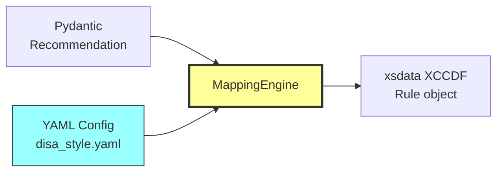

# MappingEngine User Guide

**Practical guide to working with the configuration-driven XCCDF transformation system**

!!! info "Documentation Path"
**You are here:** Developer Guide > MappingEngine User Guide

**New to terms?** See [Glossary](../about/glossary.md) for definitions of MappingEngine, YAML, transformation, field mapping, xsdata, etc.

!!! success "December 2025 Update"
**Generic Structure Handlers:** The MappingEngine now uses 3 generic handlers that work for ANY compliance framework:

- `ident_from_list` - Any index/taxonomy (CCI, MITRE, PCI-DSS, etc.)
- `metadata_from_config` - Any nested XML structure
- `generate_profiles_from_rules` - Any applicability system

**Adding PCI-DSS, ISO 27001, HIPAA:** YAML config only (no code changes)
See [Adding PCI-DSS Guide](adding-pci-dss.md)

---

## What is the MappingEngine?

The [MappingEngine](../about/glossary.md#mappingengine) is a **[config-driven](../about/glossary.md#config-driven) [transformation](../about/glossary.md#transformation) system** that converts CIS [Benchmark](../about/glossary.md#benchmark) data ([Pydantic models](../about/glossary.md#pydantic-model)) into [XCCDF](../about/glossary.md#xccdf) XML format using YAML configuration files.

**Think of it as:** A translator that reads instructions from a YAML file and transforms data from one [format](../about/glossary.md#format) to another - without writing code.



**Key Benefit:** Change XCCDF output structure by editing YAML, not Python code.

---

## Quick Example

**Problem:** You want to change how the description field appears in XCCDF.

**Without MappingEngine (hard-coded):**
```python
# exporters/xccdf_disa_exporter.py (BAD - don't do this)
def map_description(recommendation):
desc = f"<VulnDiscussion>{recommendation.description}</VulnDiscussion>"
desc += f"<FalsePositives></FalsePositives>"
# ... 50 more lines of string manipulation
return desc
```

**With MappingEngine (config-driven):**
```yaml
# exporters/configs/disa_style.yaml (GOOD - do this)
description:
structure: "embedded_xml_tags"
components:

- tag: "VulnDiscussion"
sources:

- field: "description"
- field: "rationale"
separator: "\n\n"

- tag: "FalsePositives"
content: ""
```

**Result:** Same output, but now you can:

- Change structure without touching code
- Support multiple XCCDF styles
- Test configurations independently
- Reuse transformations across styles

---

## YAML Configuration Structure

### Complete Example (Simplified)

```yaml
# my_custom_style.yaml

# Inherit base configuration
extends: base_style.yaml

# Style metadata
metadata:
style_name: "custom"
xccdf_version: "1.2"
description: "My custom XCCDF format"

# Benchmark-level settings
benchmark:
id_template: "xccdf_custom_benchmark_{benchmark_id}"
title:
source: "title"
transform: "strip_html"

# Rule-level field mappings
field_mappings:
title:
target_element: "title"
source_field: "title"
transform: "strip_html"

description:
target_element: "description"
source_field: "description"
transform: "strip_html_keep_code"

ident:
target_element: "ident"
multiple: true
cci_lookup:
source_field: "cis_controls"
extract: "primary"
```

### Configuration Sections

| Section | Purpose | Required |
|---------|---------|----------|
| `metadata` | Style identification and XCCDF version | Yes |
| `benchmark` | Benchmark-level elements and namespaces | Yes |
| `field_mappings` | Rule-level field transformations | Yes |
| `rule_defaults` | Default attributes for all rules | No |
| `transformations` | Custom transformation definitions | No |
| `validation` | Validation rules and constraints | No |

---

## Field Mapping Types

The MappingEngine supports 4 field mapping strategies:

### 1. Simple Field Mapping

**Use when:** Direct 1:1 field mapping with optional transformation

```yaml
title:
target_element: "title" # XCCDF element name
source_field: "title" # Pydantic model field
transform: "strip_html" # Transformation to apply
xccdf_type: "TextType" # xsdata type (optional)
```

**Example:**
```python
# Input (Pydantic)
recommendation.title = "<p>Ensure <code>cramfs</code> is disabled</p>"

# Config applies transform
transform = "strip_html"

# Output (xsdata)
Rule.title = TextType(value="Ensure cramfs is disabled")
```

### 2. Composite Field Mapping

**Use when:** Combine multiple source fields into one XCCDF element

```yaml
description:
target_element: "description"
structure: "composite"
sources:

- field: "description"
transform: "strip_html"

- field: "rationale"
transform: "strip_html"

- field: "impact"
transform: "strip_html"
separator: "\n\n" # Join with double newline
```

**Example:**
```python
# Input (Pydantic)
recommendation.description = "The cramfs filesystem..."
recommendation.rationale = "Removing support reduces..."
recommendation.impact = "Minimal impact expected..."

# Output (xsdata)
Rule.description = HtmlTextWithSubType(
value="The cramfs filesystem...\n\n"
"Removing support reduces...\n\n"
"Minimal impact expected..."
)
```

### 3. Embedded XML Tags (DISA STIG Format)

**Use when:** Need XML tags inside XCCDF element (like DISA VulnDiscussion)

```yaml
description:
target_element: "description"
structure: "embedded_xml_tags"
components:

- tag: "VulnDiscussion"
sources:

- field: "description"
- field: "rationale"
separator: "\n\n"

- tag: "FalsePositives"
content: "" # Empty (DISA legacy)

- tag: "PotentialImpacts"
sources:

- field: "impact"
optional: true # Only if field exists
```

**Example:**
```python
# Output (xsdata)
Rule.description = HtmlTextWithSubType(
value="<VulnDiscussion>The cramfs filesystem...\n\n"
"Removing support reduces...</VulnDiscussion>"
"<FalsePositives></FalsePositives>"
"<PotentialImpacts>Minimal impact...</PotentialImpacts>"
)
```

**Rendered XML:**
```xml
<description>
<VulnDiscussion>The cramfs filesystem is a compressed read-only filesystem...

Removing support for unneeded filesystem types reduces attack surface.</VulnDiscussion>
<FalsePositives></FalsePositives>
<PotentialImpacts>Minimal impact expected.</PotentialImpacts>
</description>
```

### 4. List Field Mapping

**Use when:** Create multiple XCCDF elements from a list (like CCI identifiers)

```yaml
ident:
target_element: "ident"
multiple: true # Creates one <ident> per CCI
cci_lookup:
enabled: true
source_field: "cis_controls"
extract: "primary"
deduplicate_nist: true
attributes:
system: "http://cyber.mil/cci"
```

**Example:**
```python
# Input (Pydantic)
recommendation.cis_controls = [
{"id": "4.1", ...},
{"id": "4.8", ...}
]

# CCI lookup
# 4.1 ["CCI-001234", "CCI-001235"]
# 4.8 ["CCI-000381", "CCI-000382"]

# After deduplication
ccis = ["CCI-001234", "CCI-000381", "CCI-000382"]

# Output (xsdata)
Rule.ident = [
IdentType(value="CCI-001234", system="http://cyber.mil/cci"),
IdentType(value="CCI-000381", system="http://cyber.mil/cci"),
IdentType(value="CCI-000382", system="http://cyber.mil/cci")
]
```

**Rendered XML:**
```xml
<ident system="http://cyber.mil/cci">CCI-001234</ident>
<ident system="http://cyber.mil/cci">CCI-000381</ident>
<ident system="http://cyber.mil/cci">CCI-000382</ident>
```

---

## Available Transformations

Transformations are defined in `base_style.yaml` and can be used by any field:

### strip_html
Removes all HTML tags, returns plain text.

```yaml
title:
source_field: "title"
transform: "strip_html"
```

```python
Input: "<p>Ensure <code>cramfs</code> is disabled</p>"
Output: "Ensure cramfs is disabled"
```

### strip_html_keep_code
Strips HTML but preserves code blocks and lists.

```yaml
audit:
source_field: "audit"
transform: "strip_html_keep_code"
```

```python
Input: "<p>Run: <code>modprobe -n -v cramfs</code></p><pre>grep cramfs</pre>"
Output: "Run: `modprobe -n -v cramfs`\n\n```\ngrep cramfs\n```"
```

### html_to_markdown
Converts HTML to Markdown format.

```yaml
description:
source_field: "description"
transform: "html_to_markdown"
```

```python
Input: "<p>The <code>cramfs</code> filesystem <strong>must</strong> be disabled.</p>"
Output: "The `cramfs` filesystem **must** be disabled."
```

### none
Pass through unchanged (no transformation).

```yaml
version:
source_field: "version"
transform: "none"
```

---

## Variable Substitution

Use `{variable}` syntax to insert dynamic values:

### Available Variables

**From Recommendation:**

- `{ref}` - Recommendation number (e.g., "1.1.1")
- `{ref_normalized}` - Underscored version (e.g., "1_1_1")
- `{title}` - Recommendation title
- Any Pydantic field name

**From Benchmark:**

- `{benchmark.title}` - Benchmark title
- `{benchmark.version}` - Benchmark version
- `{benchmark.url}` - Benchmark URL
- `{benchmark_id}` - Numeric ID

**Generated:**

- `{download_date}` - Current date
- `{platform}` - Inferred platform name

### Example: Dynamic Attributes

```yaml
fixtext:
target_element: "fixtext"
source_field: "remediation"
transform: "strip_html_keep_code"
attributes:
fixref: "F-{ref_normalized}" # F-1_1_1, F-1_1_2, etc.
```

**Result:**
```xml
<fixtext fixref="F-1_1_1">Run: modprobe -n -v cramfs</fixtext>
<fixtext fixref="F-2_3_5">Edit /etc/ssh/sshd_config</fixtext>
```

---

## CCI Lookup Configuration

CCI (Control Correlation Identifier) lookup is a special feature for DISA compliance:

### Basic CCI Lookup

```yaml
ident:
target_element: "ident"
multiple: true
cci_lookup:
enabled: true
mapping_file: "data/cis-cci-mapping.json"
source_field: "cis_controls" # Look up CCIs from CIS Controls
extract: "primary" # "primary" or "all"
deduplicate_nist: true # Remove duplicate NIST mappings
attributes:
system: "http://cyber.mil/cci"
```

### Extract Options

**`extract: "primary"`** (Recommended for DISA)

- Returns only the primary CCI for each NIST control
- Result: 1-3 CCIs per recommendation
- Cleaner XCCDF output

**`extract: "all"`** (Comprehensive)

- Returns primary + all supporting CCIs
- Result: 6-20 CCIs per recommendation
- More complete but verbose

### Example: CCI Lookup Flow

```python
# Input
recommendation.cis_controls = [
{"id": "4.1", "title": "..."},
{"id": "4.8", "title": "..."}
]

# Step 1: Look up NIST controls for each CIS Control
# 4.1 CM-8, CM-8(1)
# 4.8 CM-7, CM-7(1)

# Step 2: Look up CCIs for each NIST control
# CM-8 CCI-000389 (primary) + 3 supporting
# CM-8(1) CCI-000390 (primary) + 2 supporting
# CM-7 CCI-000381 (primary) + 2 supporting
# CM-7(1) CCI-000382 (primary) + 1 supporting

# Step 3: Extract (based on config)
if extract == "primary":
ccis = ["CCI-000389", "CCI-000390", "CCI-000381", "CCI-000382"]
else: # "all"
ccis = ["CCI-000389", "CCI-xxx", "CCI-yyy", ...] # 12 total

# Step 4: Deduplicate
ccis = unique(ccis) # Remove any duplicates

# Output
Rule.ident = [IdentType(value=cci) for cci in ccis]
```

---

## How to Add a New Field to XCCDF

**Scenario:** You want to add the "default_value" field to XCCDF output.

### Step 1: Check Pydantic Model

Verify the field exists:

```python
# src/cis_bench/models/benchmark.py
class Recommendation(BaseModel):
# ...
default_value: Optional[str] = None # Field exists
```

### Step 2: Choose XCCDF Element

Decide where it belongs in XCCDF. Options:

- New `<default>` element
- Add to existing `<description>` with custom tag
- Add as metadata

Let's add as a new element:

### Step 3: Update YAML Config

```yaml
# src/cis_bench/exporters/configs/disa_style.yaml

field_mappings:
# ... existing mappings

default_value: # New mapping
target_element: "default"
source_field: "default_value"
transform: "strip_html"
optional: true # Only include if field has value
xccdf_type: "TextType"
```

### Step 4: Test the Change

```bash
# Export with new config
cis-bench export 23598 --format xccdf --style disa -o test.xml

# Check output
grep "<default>" test.xml
```

**Result:**
```xml
<Rule id="xccdf_rule_1_1_1">
<title>Ensure mounting of cramfs is disabled</title>
<description>...</description>
<default>Not applicable - module should not be loaded</default>
<ident>...</ident>
</Rule>
```

**That's it!** No Python code changes needed.

---

## How to Create a New XCCDF Style

**Scenario:** You want to create a "minimal" XCCDF style with only essential fields.

### Step 1: Create New Config File

```bash
# Create new style config
touch src/cis_bench/exporters/configs/minimal_style.yaml
```

### Step 2: Define Configuration

```yaml
# src/cis_bench/exporters/configs/minimal_style.yaml

# Inherit base
extends: base_style.yaml

# Style metadata
metadata:
style_name: "minimal"
description: "Minimal XCCDF with only essential fields"
xccdf_version: "1.2"
xccdf_namespace: "http://checklists.nist.gov/xccdf/1.2"

# Benchmark settings
benchmark:
id_template: "xccdf_minimal_benchmark_{benchmark_id}"

title:
source: "title"
transform: "strip_html"

description:
source: "title"
prepend_text: "CIS Benchmark - Minimal Export. "

version:
source: "version"

# Rule-level field mappings (minimal set)
field_mappings:
title:
target_element: "title"
source_field: "title"
transform: "strip_html"

description:
target_element: "description"
source_field: "description"
transform: "strip_html_keep_code"

# Just one check element (simplified)
check:
target_element: "check"
structure: "nested"
attributes:
system: "urn:cis:check"
children:

- element: "check-content"
source_field: "audit"
transform: "strip_html_keep_code"
```

### Step 3: Register in Exporter

```python
# src/cis_bench/exporters/xccdf_unified_exporter.py

SUPPORTED_STYLES = {
'disa': 'configs/disa_style.yaml',
'cis': 'configs/cis_style.yaml',
'minimal': 'configs/minimal_style.yaml' # Add this line
}
```

### Step 4: Test Your New Style

```bash
# Export with new style
cis-bench export 23598 --format xccdf --style minimal -o minimal.xml

# Verify output
less minimal.xml
```

**That's it!** You've created a new XCCDF style without modifying transformation logic.

---

## Working with Config Inheritance

### Base Style Pattern

```yaml
# base_style.yaml - Common configuration
transformations:
strip_html:
function: "HTMLCleaner.strip_html"

benchmark:
namespaces:
default: "http://checklists.nist.gov/xccdf/1.2"
dc: "http://purl.org/dc/elements/1.1/"
```

### Child Style Inherits

```yaml
# disa_style.yaml
extends: base_style.yaml # Inherit all from base

# Override specific settings
metadata:
xccdf_version: "1.1.4" # Override (base has 1.2)

# Add new transformations
transformations:
custom_disa_transform:
function: "MyCustomTransform"

# field_mappings are merged (not replaced)
field_mappings:
title:
source_field: "title" # Uses strip_html from base
```

**Inheritance Rules:**
1. `transformations` - Merged (child adds to base)
2. `field_mappings` - Merged (child adds/overrides)
3. `metadata` - Child overrides base
4. `benchmark` - Child overrides base
5. `namespaces` - Merged (child adds to base)

---

## Advanced Features

### Conditional Mapping

Map fields only when certain conditions are met:

```yaml
impact_statement:
target_element: "impact"
source_field: "impact"
transform: "strip_html"
optional: true # Only include if field has value
condition:
field: "impact"
not_empty: true # Only map if field is not empty/None
```

### Nested Structures

Create nested XCCDF elements:

```yaml
check:
target_element: "check"
structure: "nested"
attributes:
system: "C-{ref_normalized}"
children:

- element: "check-content-ref"
attributes:
name: "oval:check:{ref_normalized}:def:1"
href: "oval-definitions.xml"

- element: "check-content"
source_field: "audit"
transform: "strip_html_keep_code"
```

**Output:**
```xml
<check system="C-1_1_1">
<check-content-ref
name="oval:check:1_1_1:def:1"
href="oval-definitions.xml"/>
<check-content>Run: modprobe -n -v cramfs</check-content>
</check>
```

### Custom Metadata Blocks

Add CIS Controls as structured metadata:

```yaml
cis_controls_metadata:
  structure: "metadata_from_config"
  requires_post_processing: true
  source_field: "cis_controls"
  metadata_spec:
    root_element: "cis_controls"
    namespace: "http://cisecurity.org/controls"
    group_by: "item.version"
    group_element:
      element: "framework"
      attributes:
        urn: "urn:cisecurity.org:controls:{group_key}"
      item_element:
        element: "safeguard"
        # ... (see cis_style.yaml for complete spec)
```

**Output:**
```xml
<metadata>
<controls:control id="4.1" version="8" ig="IG1">
Establish and Maintain Secure Configuration Process
</controls:control>
<controls:control id="4.8" version="8" ig="IG2">
Uninstall or Disable Unnecessary Services
</controls:control>
</metadata>
```

---

## Real-World Example: Complete Field Mapping

Let's walk through mapping the `fixtext` element for DISA STIG:

### DISA STIG Requirement

```xml
<fixtext fixref="F-1_1_1">
Edit /etc/modprobe.d/cramfs.conf and add:
install cramfs /bin/true
</fixtext>
```

**Requirements:**
1. Element name: `fixtext`
2. Attribute: `fixref` with format "F-{ref_normalized}"
3. Content: Remediation text with code preserved
4. Type: FixTextType (xsdata)

### YAML Configuration

```yaml
fixtext:
target_element: "fixtext" # 1. Element name
source_field: "remediation" # Source from Pydantic
transform: "strip_html_keep_code" # 3. Preserve code blocks
attributes: # 2. Dynamic attribute
fixref: "F-{ref_normalized}"
xccdf_type: "FixTextType" # 4. xsdata type
```

### MappingEngine Process

```python
# 1. Load config
config = field_mappings['fixtext']

# 2. Get source data
source_value = getattr(recommendation, 'remediation')
# "<p>Edit <code>/etc/modprobe.d/cramfs.conf</code> and add:<pre>install cramfs /bin/true</pre></p>"

# 3. Apply transformation
transformed = apply_transform(source_value, 'strip_html_keep_code')
# "Edit `/etc/modprobe.d/cramfs.conf` and add:\n\n```\ninstall cramfs /bin/true\n```"

# 4. Substitute variables in attributes
ref_normalized = recommendation.ref.replace('.', '_') # "1.1.1" "1_1_1"
fixref_value = f"F-{ref_normalized}" # "F-1_1_1"

# 5. Create xsdata object
fixtext = FixTextType(
value=transformed,
fixref=fixref_value
)

# 6. Add to Rule
rule.fixtext = fixtext
```

### Verification

```bash
# Export and check
cis-bench export 23598 --format xccdf --style disa -o output.xml
grep -A3 "<fixtext" output.xml
```

**Output:**
```xml
<fixtext fixref="F-1_1_1">
Edit `/etc/modprobe.d/cramfs.conf` and add:

```
install cramfs /bin/true
```
</fixtext>
```

---

## Debugging Mapping Issues

### Enable Verbose Logging

```bash
cis-bench --verbose export 23598 --format xccdf --style disa
```

**Logs show:**
```
DEBUG: Loading config: disa_style.yaml
DEBUG: Processing field: title
DEBUG: Source value: "<p>Ensure cramfs disabled</p>"
DEBUG: Applying transform: strip_html
DEBUG: Result: "Ensure cramfs disabled"
DEBUG: Creating TextType object
```

### Common Issues

**Issue: "Field not found"**
```
KeyError: 'custom_field'
```
**Fix:** Add field to Pydantic model or use `optional: true` in config

**Issue: "Invalid xsdata type"**
```
TypeError: Rule.title expects TextType, got str
```
**Fix:** Check `xccdf_type` in config matches xsdata model

**Issue: "CCI lookup returns no results"**
```
WARNING: No CCIs found for CIS Control 18.1
```
**Fix:** CCI mapping file incomplete, control is INFERRED (has no CCIs)

**Issue: "Namespace prefix not declared"**
```
ERROR: Namespace prefix 'controls' not defined
```
**Fix:** Add namespace to `benchmark.namespaces` in config

---

## Testing Your Configuration Changes

### Unit Test Configuration Loading

```python
# tests/unit/test_mapping_config.py

def test_load_custom_style():
"""Test loading custom style config."""
config = load_yaml_config('configs/my_custom_style.yaml')

assert config['metadata']['style_name'] == 'custom'
assert 'title' in config['field_mappings']
```

### Integration Test Export

```python
# tests/integration/test_custom_xccdf.py

def test_custom_style_export(sample_benchmark):
"""Test exporting with custom style."""
exporter = XCCDFUnifiedExporter(style='custom')
xccdf = exporter.export(sample_benchmark)

# Verify structure
assert xccdf.id.startswith('xccdf_custom_benchmark_')
assert len(xccdf.group[0].rule) > 0
```

### Manual Validation

```bash
# Export
cis-bench export 23598 --format xccdf --style custom -o test.xml

# Validate against schema
xmllint --schema schemas/xccdf-1.2.xsd test.xml

# Check specific elements
xmllint --xpath "//Rule/title" test.xml
xmllint --xpath "count(//ident)" test.xml
```

---

## Best Practices

### 1. Start from Base Style

Always extend `base_style.yaml`:
```yaml
extends: base_style.yaml # Do not start from scratch
```

### 2. Use Descriptive Names

```yaml
# Good
field_mappings:
vulnerability_discussion:
target_element: "description"

# Bad
field_mappings:
desc:
target_element: "description"
```

### 3. Document Your Transformations

```yaml
transformations:
custom_transform:
description: "Converts CIS-style lists to DISA bullet points" # Document!
function: "MyTransformers.convert_lists"
```

### 4. Test Each Field Mapping

Do not add 10 mappings at once. Add one, test, commit, repeat.

### 5. Use Optional Wisely

```yaml
impact_statement:
source_field: "impact"
optional: true # Good - impact field might not exist

title:
source_field: "title"
optional: false # Good - title is required
```

### 6. Validate xsdata Types

Check the xsdata model to ensure type matches:

```python
# src/cis_bench/models/xccdf_v1_1/__init__.py
class Rule:
title: TextWithSubType # Not TextType!
```

```yaml
# Config must match
title:
xccdf_type: "TextWithSubType" # Matches
```

---

## Configuration File Locations

```
src/cis_bench/exporters/configs/
├── base_style.yaml # Common config (inherit from this)
├── disa_style.yaml # DISA STIG format
├── cis_style.yaml # CIS native format (if exists)
└── custom_style.yaml # Your custom style
```

**Data files:**
```
src/cis_bench/data/
└── cis-cci-mapping.json # CIS Control CCI mappings
```

---

## Example: Minimal Working Config

Here's a complete minimal style that actually works:

```yaml
# minimal_working_style.yaml

extends: base_style.yaml

metadata:
style_name: "minimal"
xccdf_version: "1.2"

benchmark:
id_template: "xccdf_minimal_{benchmark_id}"

title:
source: "title"
transform: "strip_html"

version:
source: "version"

field_mappings:
title:
target_element: "title"
source_field: "title"
transform: "strip_html"
xccdf_type: "TextType"

description:
target_element: "description"
source_field: "description"
transform: "strip_html"
xccdf_type: "HtmlTextWithSubType"

check:
target_element: "check"
structure: "nested"
attributes:
system: "urn:minimal:check"
children:

- element: "check-content"
source_field: "audit"
transform: "strip_html_keep_code"
```

**This produces:**
```xml
<Benchmark id="xccdf_minimal_23598">
<title>CIS AlmaLinux OS 10 Benchmark</title>
<description>CIS AlmaLinux OS 10 Benchmark</description>
<version>1.0.0</version>
<Group>
<Rule>
<title>Ensure cramfs is disabled</title>
<description>The cramfs filesystem type...</description>
<check system="urn:minimal:check">
<check-content>modprobe -n -v cramfs</check-content>
</check>
</Rule>
</Group>
</Benchmark>
```

---

## Common Patterns

### Pattern 1: Combining Multiple Fields

```yaml
remediation_full:
target_element: "fix"
sources:

- field: "remediation"
label: "Remediation:"

- field: "default_value"
label: "Default:"

- field: "references"
label: "References:"
separator: "\n\n"
```

### Pattern 2: Conditional Content

```yaml
impact:
target_element: "impact"
source_field: "impact"
transform: "strip_html"
optional: true
default: "No impact information available" # Use if field empty
```

### Pattern 3: List Expansion

```yaml
profiles:
target_element: "profile"
source_field: "profiles"
multiple: true # One <profile> per list item
transform: "none"
```

**Input:**
```python
recommendation.profiles = ["Level 1 - Server", "Level 2 - Workstation"]
```

**Output:**
```xml
<profile>Level 1 - Server</profile>
<profile>Level 2 - Workstation</profile>
```

---

## MappingEngine Code Reference

**Main class:** `src/cis_bench/exporters/mapping_engine.py`

**Key methods:**

```python
class MappingEngine:
def __init__(self, config: dict):
"""Initialize with loaded YAML config."""

def map_benchmark(self, benchmark: Benchmark) -> XCCDFBenchmark:
"""Map Pydantic Benchmark to xsdata Benchmark."""

def map_recommendation(self, rec: Recommendation) -> Rule:
"""Map Pydantic Recommendation to xsdata Rule."""
# THIS IS THE CORE METHOD
# Loops through field_mappings and applies each

def apply_field_mapping(self, rec, field_config):
"""Apply single field mapping based on config."""

def apply_transformation(self, value, transform_name):
"""Apply named transformation from config."""
```

**Critical loop (line ~150):**
```python
def map_recommendation(self, recommendation):
"""Map recommendation using config."""
rule = Rule(id=self.generate_rule_id(recommendation))

# LOOP-DRIVEN ARCHITECTURE (DO NOT HARD-CODE FIELDS!)
for field_name, mapping in self.config['field_mappings'].items():
value = self.apply_field_mapping(recommendation, mapping)
setattr(rule, field_name, value)

return rule
```

**This is why config-driven works:**

- Add field to YAML automatically mapped
- Remove field from YAML automatically excluded
- No code changes needed

---

## Troubleshooting Configuration

### Validation Errors

**Symptom:** Export fails with validation error

**Debug:**
```bash
# Check config loads correctly
python3 << EOF
from cis_bench.exporters.mapping_engine import load_yaml_config
config = load_yaml_config('configs/my_style.yaml')
print(config.keys())
EOF
```

### Transformation Not Applied

**Symptom:** HTML still in output when it should be stripped

**Debug:**
```yaml
# Add logging to transformation
title:
source_field: "title"
transform: "strip_html"
debug: true # Enable debug logging for this field
```

### Missing Output

**Symptom:** Field doesn't appear in XCCDF

**Check:**
1. Field exists in Pydantic model?
2. Field mapping in config?
3. Optional field but value is None?
4. Transformation returning empty string?

---

## Related Documentation

- [Data Flow Pipeline](data-flow-pipeline.md) - Complete transformation process
- [Mapping Engine Design](../technical-reference/mapping-engine-design.md) - Technical architecture
- [YAML Config Reference](../technical-reference/yaml-config-reference.md) - Complete syntax guide
- [How to Add XCCDF Style](how-to-add-xccdf-style.md) - Step-by-step tutorial

---

## Summary

The MappingEngine provides:

**Flexibility** - Change XCCDF structure without code changes
**Reusability** - Share transformations across styles
**Maintainability** - Clear separation of data and structure
**Extensibility** - Add new styles in minutes
**Testability** - Test configs independent of code

**Key Principle:** Configuration defines **WHAT** to map, code defines **HOW** to map it.
