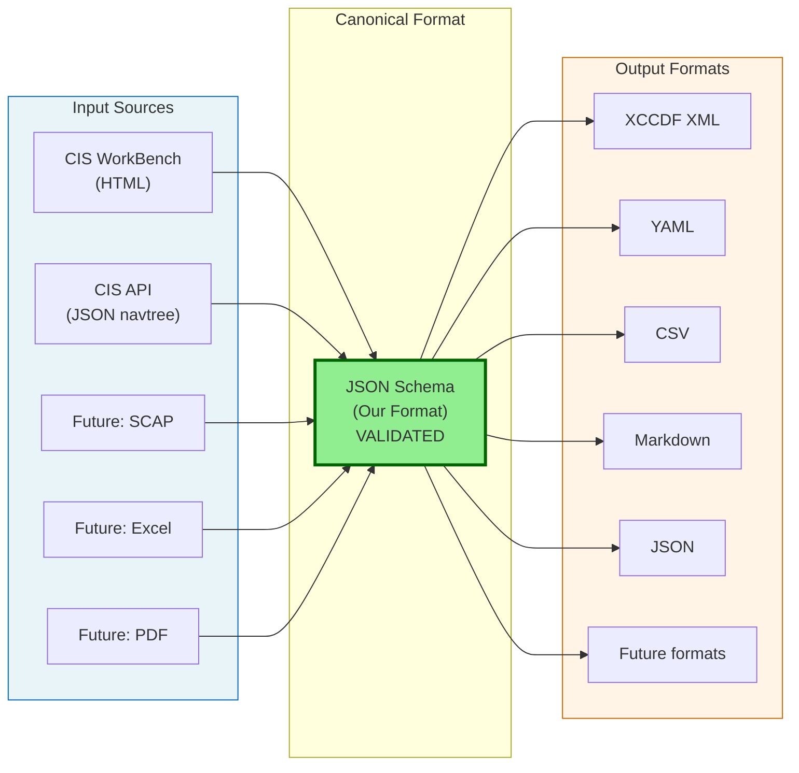
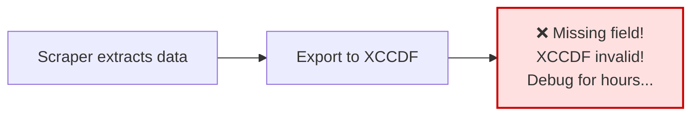
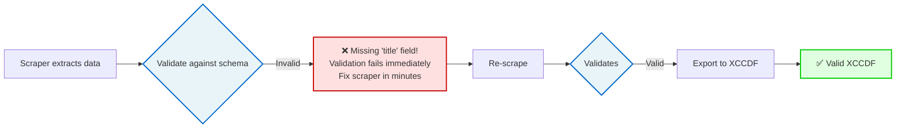

# CIS Benchmark CLI - Data Model and JSON Schema

!!! info "Documentation Path"
    **You are here:** Technical Reference > Data Model

    - **For architecture:** See [Architecture Overview](../developer-guide/architecture.md)
    - **For data flow:** See [Data Flow Pipeline](../developer-guide/data-flow-pipeline.md)

## Overview

This document defines our **canonical data format** for CIS benchmarks. All data flows through this format.

## Data Flow Architecture



**KEY PRINCIPLE:** All data MUST validate against our JSON Schema before it can be exported to any format.

## Why JSON Schema as Canonical Format?

### Benefits

**Single Source of Truth**

- All exporters map from ONE format
- No exporter-specific logic in scraper
- Clear contract between components

**Validation**

- Ensure scraped data is complete
- Catch extraction errors early
- Verify required fields present

**Documentation**

- Self-documenting data format
- Clear field definitions
- Type information

**Versioning**

- Schema v1.0, v2.0 as needs evolve
- Backward compatibility tracking
- Migration paths

**Code Generation**

- Can generate Python dataclasses from schema
- Type hints from schema
- Validation code auto-generated

**Testing**

- Validate test fixtures
- Ensure exporters get expected input
- Clear test assertions

## Our JSON Schema

### Location
`cis_bench/models/schema.json`

### Structure

```json
{
"$schema": "http://json-schema.org/draft-07/schema#",
"$id": "https://github.com/yourusername/cis-benchmark-cli/schemas/benchmark-v1.0.json",
"title": "CIS Benchmark",
"description": "Canonical data format for CIS Benchmark downloaded from CIS WorkBench",
"type": "object",
"required": ["title", "benchmark_id", "url", "version", "recommendations"],
"properties": {
"title": {
"type": "string",
"description": "Full benchmark title (e.g., 'CIS Amazon EKS Benchmark v1.8.0')",
"examples": ["CIS Amazon EKS Benchmark v1.8.0", "CIS NGINX Benchmark vNEXT"]
},
"benchmark_id": {
"type": "string",
"description": "CIS WorkBench benchmark ID",
"pattern": "^[0-9]+$",
"examples": ["22605", "18528"]
},
"url": {
"type": "string",
"format": "uri",
"description": "Source URL of the benchmark"
},
"version": {
"type": "string",
"description": "Benchmark version (extracted from title or metadata)",
"examples": ["v1.8.0", "vNEXT", "v1.0.0"]
},
"downloaded_at": {
"type": "string",
"format": "date-time",
"description": "ISO 8601 timestamp when benchmark was downloaded"
},
"scraper_version": {
"type": "string",
"description": "Scraper strategy version used",
"examples": ["v1_2025_10"]
},
"total_recommendations": {
"type": "integer",
"minimum": 0,
"description": "Total number of recommendations in benchmark"
},
"recommendations": {
"type": "array",
"description": "Array of benchmark recommendations",
"items": {
"$ref": "#/$defs/recommendation"
}
}
},

"$defs": {
"recommendation": {
"type": "object",
"required": ["ref", "title", "url"],
"properties": {
"ref": {
"type": "string",
"description": "Recommendation reference number",
"pattern": "^[0-9]+(\\.[0-9]+)*$",
"examples": ["3.1.1", "5.2.3"]
},
"title": {
"type": "string",
"description": "Recommendation title",
"minLength": 1
},
"url": {
"type": "string",
"format": "uri",
"description": "Direct URL to recommendation page"
},
"assessment": {
"type": ["string", "null"],
"description": "Automated scoring/assessment information (may contain HTML)"
},
"description": {
"type": ["string", "null"],
"description": "Detailed description of the recommendation (may contain HTML)"
},
"rationale": {
"type": ["string", "null"],
"description": "Rationale/justification for the recommendation (may contain HTML)"
},
"impact": {
"type": ["string", "null"],
"description": "Impact statement (may contain HTML)"
},
"audit": {
"type": ["string", "null"],
"description": "Audit procedure to verify compliance (may contain HTML)"
},
"remediation": {
"type": ["string", "null"],
"description": "Remediation steps to achieve compliance (may contain HTML)"
},
"default_value": {
"type": ["string", "null"],
"description": "Default configuration value (may contain HTML)"
},
"artifact_eq": {
"type": ["string", "null"],
"description": "Artifact equation (may contain HTML)"
},
"mitre_mapping": {
"type": ["string", "null"],
"description": "MITRE ATT&CK framework mappings (may contain HTML)"
},
"references": {
"type": ["string", "null"],
"description": "External references and citations (may contain HTML)"
}
},
"additionalProperties": false
}
}
}
```

## Using JSON Schema

### Validation

```python
import json
import jsonschema

# Load schema
with open('cis_bench/models/schema.json') as f:
schema = json.load(f)

# Validate scraped data
try:
jsonschema.validate(instance=benchmark_data, schema=schema)
print(" Data is valid")
except jsonschema.ValidationError as e:
print(f" Validation failed: {e.message}")
print(f" Path: {' '.join(str(p) for p in e.path)}")
```

### Data Generation from Schema

We can also use tools like `datamodel-code-generator` to create Python dataclasses from our schema:

```bash
pip install datamodel-code-generator

datamodel-codegen \
--input cis_bench/models/schema.json \
--output cis_bench/models/benchmark.py \
--input-file-type jsonschema
```

This generates type-safe Python classes that match our schema exactly!

## Exporter Mapping

Each exporter knows how to map from our canonical format to its target format:

### JSON Exporter
```python
# Simple pass-through (already in our format)
def export(self, data, output_path):
with open(output_path, 'w') as f:
json.dump(data, f, indent=2)
```

### YAML Exporter
```python
# Direct mapping (structure is the same)
def export(self, data, output_path):
with open(output_path, 'w') as f:
yaml.dump(data, f)
```

### CSV Exporter
```python
# Flatten recommendations array
def export(self, data, output_path):
rows = []
for rec in data['recommendations']:
row = {
'benchmark_title': data['title'],
'benchmark_id': data['benchmark_id'],
'ref': rec['ref'],
'title': rec['title'],
# ... flatten all fields
}
rows.append(row)

# Write CSV
with open(output_path, 'w') as f:
writer = csv.DictWriter(f, fieldnames=row.keys())
writer.writeheader()
writer.writerows(rows)
```

### XCCDF Exporter
```python
# Map to xsdata XCCDF models
def export(self, data, output_path):
from cis_bench.models.xccdf import Benchmark, Rule, Status

# Create XCCDF Benchmark
xccdf_benchmark = Benchmark(
id=f"cis_benchmark_{data['benchmark_id']}",
status=[Status(value="draft")],
title=data['title'],
version=data['version']
)

# Map each recommendation XCCDF Rule
for rec in data['recommendations']:
rule = Rule(
id=f"rule_{rec['ref'].replace('.', '_')}",
title=rec['title'],
description=strip_html(rec['description']),
# ... map other fields per XCCDF spec
)
xccdf_benchmark.rule.append(rule)

# Serialize to XML
xml_output = xccdf_benchmark.to_xml(pretty_print=True)
with open(output_path, 'w') as f:
f.write(xml_output)
```

## Field Definitions

### Benchmark Level

| Field | Type | Required | Description |
|-------|------|----------|-------------|
| `title` | string | | Full benchmark title |
| `benchmark_id` | string | | CIS WorkBench ID |
| `url` | string (URI) | | Source URL |
| `version` | string | | Benchmark version |
| `downloaded_at` | string (ISO 8601) | | Download timestamp |
| `scraper_version` | string | | Strategy version used |
| `total_recommendations` | integer | | Count of recommendations |
| `recommendations` | array | | Array of recommendation objects |

### Recommendation Level

| Field | Type | Required | Description | HTML Allowed |
|-------|------|----------|-------------|--------------|
| `ref` | string | | Reference number (e.g., "3.1.1") | No |
| `title` | string | | Recommendation title | No |
| `url` | string (URI) | | Direct link to recommendation | No |
| `assessment` | string/null | | Automated scoring info | Yes |
| `description` | string/null | | Detailed description | Yes |
| `rationale` | string/null | | Justification | Yes |
| `impact` | string/null | | Impact statement | Yes |
| `audit` | string/null | | Audit procedure | Yes |
| `remediation` | string/null | | Remediation steps | Yes |
| `default_value` | string/null | | Default config value | Yes |
| `artifact_eq` | string/null | | Artifact equation | Yes |
| `mitre_mapping` | string/null | | MITRE ATT&CK mappings | Yes |
| `references` | string/null | | External references | Yes |

**HTML Allowed**: Fields may contain HTML markup that should be:

- Preserved in JSON/YAML export
- Stripped for CSV export
- Converted to XCCDF-safe format for XCCDF export

## Validation Strategy

### When to Validate

1. **After scraping** - Before saving JSON
2. **Before exporting** - Ensure input is valid
3. **In tests** - Validate all fixtures

### Validation Levels

**Strict** (for our saved JSON):

- All required fields present
- Types match schema
- Additional properties not allowed

**Lenient** (for backward compatibility):

- Required fields present
- Types match when present
- Additional properties allowed (ignore)

## Schema Evolution

### Version 1.0.0 (Current)

- Initial schema
- Based on current CIS WorkBench fields
- Includes all 10 recommendation fields

### Version 1.1.0 (Future)

- Add new fields as CIS WorkBench evolves
- Maintain backward compatibility
- Use `oneOf` for version-specific fields

### Version 2.0.0 (Future)

- Breaking changes if needed
- Migration guide provided
- Tool supports both v1 and v2

## Tools and Libraries

**JSON Schema Validation**:
```bash
pip install jsonschema
```

**Code Generation from Schema**:
```bash
pip install datamodel-code-generator
```

**Schema Documentation**:
```bash
pip install json-schema-for-humans
json-schema-for-humans cis_bench/models/schema.json docs/schema.html
```

## Example: Complete Benchmark

```json
{
"title": "CIS Amazon Elastic Kubernetes Service (EKS) Benchmark",
"benchmark_id": "22605",
"url": "https://workbench.cisecurity.org/benchmarks/22605",
"version": "v1.8.0",
"downloaded_at": "2025-10-17T21:48:00Z",
"scraper_version": "v1_2025_10",
"total_recommendations": 50,
"recommendations": [
{
"ref": "3.1.1",
"title": "Ensure that the kubeconfig file permissions are set to 644 or more restrictive",
"url": "https://workbench.cisecurity.org/sections/3511915/recommendations/5772605",
"assessment": "<p>Automated assessment available</p>",
"description": "<p>If kubelet is running, and if it is configured by a kubeconfig file...</p>",
"rationale": "<p>Improper access permissions could allow...</p>",
"impact": "<p>None expected</p>",
"audit": "<p>Run the following command: <code>stat -c %a /var/lib/kubelet/kubeconfig</code></p>",
"remediation": "<p>Run: <code>chmod 644 /var/lib/kubelet/kubeconfig</code></p>",
"default_value": null,
"artifact_eq": null,
"mitre_mapping": "<p>T1574.006 - Hijack Execution Flow: Dynamic Linker Hijacking</p>",
"references": "<ul><li>Kubernetes documentation</li></ul>"
}
// ... 49 more recommendations
]
}
```

## Integration with Exporters

### BaseExporter Contract

```python
class BaseExporter(ABC):
@abstractmethod
def export(self, data: dict, output_path: str) -> str:
"""Export benchmark data.

Args:
data: Dictionary matching cis_bench/models/schema.json
output_path: Where to write output

Returns:
Path to created file

Raises:
jsonschema.ValidationError: If data doesn't match schema
IOError: If file cannot be written
"""
# All exporters should validate input first
self._validate_input(data)

# Then perform export
# ...
```

### Mapping Examples

**JSON Schema Field XCCDF Field**

| Our Schema | XCCDF Element | Notes |
|------------|---------------|-------|
| `ref` | `Rule/@id` | Convert "3.1.1" "rule_3_1_1" |
| `title` | `Rule/title` | Direct mapping |
| `description` | `Rule/description` | Strip HTML tags |
| `rationale` | `Rule/rationale` | Strip HTML tags |
| `audit` | `Rule/check/check-content` | Strip HTML, wrap in check |
| `remediation` | `Rule/fixtext` | Strip HTML tags |
| `mitre_mapping` | `Rule/reference` | Parse and map to reference elements |

**JSON Schema Field CSV Column**

All fields flattened to single row:
```csv
benchmark_title,benchmark_id,ref,title,description,audit,...
"CIS Amazon EKS","22605","3.1.1","Ensure...","If kubelet...","Run...",...
```

## Validation Implementation

### In WorkbenchScraper

```python
import jsonschema

class WorkbenchScraper:
def __init__(self, session, schema_path='cis_bench/models/schema.json'):
self.session = session

# Load schema
with open(schema_path) as f:
self.schema = json.load(f)

def download_benchmark(self, benchmark_url):
# ... scraping logic ...

benchmark_data = {
'title': title,
'benchmark_id': benchmark_id,
'recommendations': recommendations,
# ...
}

# VALIDATE before returning
try:
jsonschema.validate(instance=benchmark_data, schema=self.schema)
except jsonschema.ValidationError as e:
raise ValueError(f"Scraped data validation failed: {e.message}")

return benchmark_data
```

### In Exporters

```python
class BaseExporter(ABC):
def _validate_input(self, data: dict):
"""Validate input data against schema."""
with open('cis_bench/models/schema.json') as f:
schema = json.load(f)

jsonschema.validate(instance=data, schema=schema)
```

## Schema Files

We'll maintain multiple schema versions:

```
cis_bench/models/
├── schema.json # Current schema (symlink to v1.0.0)
├── schemas/
│ ├── v1.0.0.json # Version 1.0.0
│ ├── v1.1.0.json # Version 1.1.0 (future)
│ └── v2.0.0.json # Version 2.0.0 (future)
└── schema_validator.py # Validation utilities
```

## Benefits in Practice

### Before (No Schema)



### After (With Schema)



---
