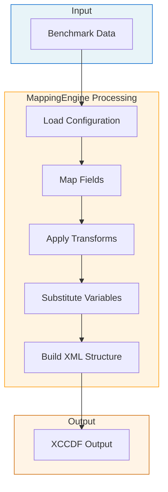
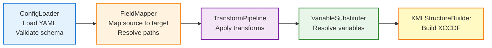
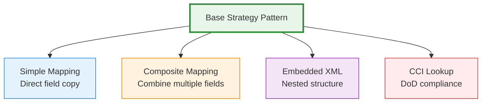

# MappingEngine Design Document

!!! info "Documentation Path"
**You are here:** Technical Reference > MappingEngine Design (Technical Architecture)

- **For practical guide:** See [MappingEngine User Guide](../developer-guide/mapping-engine-guide.md)
- **For system overview:** See [Data Flow Pipeline](../developer-guide/data-flow-pipeline.md)

This design document describes the technical architecture. The system implements the [config-driven](../about/glossary.md#config-driven), [loop-driven](../about/glossary.md#loop-driven-architecture) approach specified here.

---

## Overview

The **MappingEngine** is a configuration-driven transformation engine that maps CIS Benchmark data to various XCCDF export styles (DISA STIG-compatible, CIS Native, etc.). It reads YAML configuration files that define field mappings, transformations, and composite field assembly.

## Purpose

- **Read YAML configurations** that define how to map our Pydantic data models to XCCDF structures
- **Apply transformations** (strip_html, html_to_markdown, composite field assembly)
- **Handle complex XCCDF structures** (embedded XML tags, nested elements, variable substitution)
- **Support multiple export styles** without changing code (just swap YAML config)
- **Be extensible** for new transformations and field types

## Architecture

### High-Level Data Flow



### Component Relationships

**Main Processing Pipeline:**



**Available Transformers:**

- **StripHTML** - Remove HTML tags
- **Markdown** - Convert HTML to Markdown
- **Composite** - Combine multiple fields
- **Custom** - User-defined transformations

**Field Mapping Strategies:**



## Class Structure

### 1. Core: MappingEngine

```python
class MappingEngine:
"""Configuration-driven mapping engine for transforming Pydantic models to XCCDF.

Responsibilities:

- Load YAML configuration files
- Coordinate mapping process
- Apply transformations
- Build XCCDF structures

Usage:
engine = MappingEngine.from_config('disa_style.yaml')
xccdf_benchmark = engine.map_benchmark(pydantic_benchmark)
"""

def __init__(self, config: MappingConfig):
"""Initialize engine with loaded configuration."""
self.config = config
self.field_mapper = FieldMapper(config.field_mappings)
self.transform_registry = TransformRegistry()
self.variable_substituter = VariableSubstituter()

@classmethod
def from_config(cls, config_path: str) -> 'MappingEngine':
"""Factory method: Load config and create engine."""
config = ConfigLoader.load(config_path)
return cls(config)

def map_benchmark(self, benchmark: Benchmark) -> XCCDFBenchmark:
"""Map Pydantic Benchmark to XCCDF Benchmark.

Args:
benchmark: Validated Pydantic Benchmark model

Returns:
xsdata XCCDF Benchmark ready for XML serialization
"""

def map_rule(self, recommendation: Recommendation, context: MappingContext) -> Rule:
"""Map single Recommendation to XCCDF Rule.

Args:
recommendation: Pydantic Recommendation model
context: Mapping context (variables for substitution)

Returns:
xsdata XCCDF Rule
"""
```

### 2. Configuration: ConfigLoader and MappingConfig

```python
@dataclass
class MappingConfig:
"""Parsed YAML configuration.

Structure matches YAML file:

- metadata: Style info
- benchmark: Benchmark-level mappings
- rule_defaults: Default rule attributes
- rule_id: ID generation template
- field_mappings: Core field mapping definitions
- transformations: Transform function definitions
- validation: Validation rules
"""

style_name: str
description: str
xccdf_version: str

benchmark_mappings: Dict[str, FieldMapping]
rule_defaults: Dict[str, Any]
rule_id_template: str

field_mappings: Dict[str, FieldMapping]
transformations: Dict[str, TransformDef]

cci_lookup: Optional[CCILookupConfig] = None
validation: Optional[ValidationConfig] = None

class ConfigLoader:
"""Load and validate YAML configuration files."""

@staticmethod
def load(config_path: str) -> MappingConfig:
"""Load YAML and parse into MappingConfig.

Validates:

- YAML syntax
- Required sections present
- Field mapping structure
- Transform definitions valid

Raises:
ConfigValidationError: If config is invalid
"""

@staticmethod
def validate_config(config_dict: dict) -> None:
"""Validate configuration structure."""
```

### 3. Field Mapping: FieldMapper

```python
@dataclass
class FieldMapping:
"""Definition of how to map one field.

Types of mappings:
1. Simple: source_field target_element (with optional transform)
2. Composite: multiple sources one target (VulnDiscussion)
3. Embedded XML: nested XML tags within XCCDF element
4. Lookup-based: CCI lookup, NIST deduplication
5. Template-based: Variable substitution
"""

target_element: str
source_field: Optional[str] = None
transform: Optional[str] = None
structure: Optional[str] = None # 'embedded_xml_tags', 'nested', 'dublin_core'
multiple: bool = False

# For composite/embedded structures
components: Optional[List[ComponentMapping]] = None

# For attributes
attributes: Optional[Dict[str, str]] = None

# For static content
content: Optional[str] = None

# For conditional mapping
optional: bool = False
condition: Optional[str] = None

@dataclass
class ComponentMapping:
"""Component of a composite or embedded XML mapping."""

tag: Optional[str] = None # For embedded XML
element: Optional[str] = None # For nested elements

sources: Optional[List[SourceDef]] = None
content: Optional[str] = None

combine: Optional[str] = None # 'join', 'concat', etc.
separator: str = "\n\n"

attributes: Optional[Dict[str, str]] = None
optional: bool = False

@dataclass
class SourceDef:
"""Source field with transformation."""
field: str
transform: Optional[str] = None
separator: str = ""

class FieldMapper:
"""Maps fields from source models to target structures.

Responsibilities:

- Resolve source field paths (nested attributes)
- Apply field-level transformations
- Handle composite field assembly
- Build nested/embedded structures
"""

def __init__(self, field_mappings: Dict[str, FieldMapping]):
self.mappings = field_mappings

def map_field(self,
mapping: FieldMapping,
source_obj: Any,
context: MappingContext) -> Any:
"""Map a single field from source to target.

Handles:

- Simple field extraction
- Composite field assembly
- Embedded XML structure
- Variable substitution in templates

Returns:
Mapped value ready for XCCDF model
"""

def resolve_source_value(self, source_field: str, source_obj: Any) -> Any:
"""Resolve potentially nested field path.

Examples:
'title' source_obj.title
'mitre_mapping.techniques' source_obj.mitre_mapping.techniques
'cis_controls[0].control' source_obj.cis_controls[0].control
"""

def build_composite_field(self,
components: List[ComponentMapping],
source_obj: Any,
context: MappingContext) -> str:
"""Build composite field from multiple sources.

Example: VulnDiscussion = description + rationale
"""

def build_embedded_xml_structure(self,
components: List[ComponentMapping],
source_obj: Any,
context: MappingContext) -> str:
"""Build embedded XML tags within text content.

Example: <description>
<VulnDiscussion>...</VulnDiscussion>
<FalsePositives/>
<Mitigations>...</Mitigations>
</description>
"""
```

### 4. Transformation: TransformPipeline and Transformers

```python
class TransformRegistry:
"""Registry of available transformations.

Built-in transformations:

- none: Pass through unchanged
- strip_html: Remove all HTML tags
- strip_html_keep_code: Strip HTML but preserve code blocks
- html_to_markdown: Convert HTML to Markdown

Extensible: Register custom transforms
"""

def __init__(self):
self._transforms: Dict[str, Callable] = {}
self._register_builtin_transforms()

def register(self, name: str, transform_func: Callable):
"""Register custom transformation."""

def get_transform(self, name: str) -> Callable:
"""Get transformation function by name."""

def apply(self, transform_name: str, value: Any, **kwargs) -> Any:
"""Apply transformation to value."""

class TransformPipeline:
"""Apply series of transformations to field values."""

def __init__(self, registry: TransformRegistry):
self.registry = registry

def apply_transform(self, transform_name: str, value: Any) -> Any:
"""Apply single transformation."""

def apply_chain(self, transforms: List[str], value: Any) -> Any:
"""Apply chain of transformations in order."""

# Built-in transformers
class HTMLCleaner:
"""HTML transformation utilities."""

@staticmethod
def strip_html(html: Optional[str]) -> str:
"""Remove all HTML tags, return plain text."""

@staticmethod
def strip_html_keep_code(html: Optional[str]) -> str:
"""Strip HTML but preserve code blocks and lists."""

@staticmethod
def html_to_markdown(html: Optional[str]) -> str:
"""Convert HTML to Markdown format."""

class CompositeTransformer:
"""Build composite fields from multiple sources."""

@staticmethod
def join_with_separator(values: List[str], separator: str = "\n\n") -> str:
"""Join non-empty values with separator."""

@staticmethod
def concat(values: List[str]) -> str:
"""Concatenate values with no separator."""
```

### 5. Variable Substitution: VariableSubstituter

```python
class VariableSubstituter:
"""Substitute variables in templates with actual values.

Variables:

- {ref}: Original ref (e.g., "3.1.1")
- {ref_normalized}: Normalized ref (e.g., "3_1_1")
- {platform}: Benchmark platform
- {control.version}: CIS Control version
- {control.control}: CIS Control ID
- {nist_control_id}: NIST control ID

Used in:

- ID templates: "xccdf_cis_{platform}_rule_{ref_normalized}"
- Attributes: fixref="F-{ref_normalized}"
- Content: "{control.title}"
"""

def substitute(self, template: str, context: MappingContext) -> str:
"""Substitute all variables in template.

Args:
template: String with {variable} placeholders
context: Mapping context with variable values

Returns:
String with variables replaced
"""

def normalize_ref(self, ref: str) -> str:
"""Convert ref to normalized form: 3.1.1 3_1_1"""
return ref.replace('.', '_')

def extract_platform(self, title: str) -> str:
"""Extract platform from benchmark title."""

@dataclass
class MappingContext:
"""Context for variable substitution and conditional logic.

Contains:

- Current recommendation being mapped
- Benchmark-level metadata
- Generated IDs and references
- Loop iteration variables (for multiple elements)
"""

recommendation: Recommendation
benchmark: Benchmark
platform: str
ref_normalized: str

# For iterating over collections
current_control: Optional[CISControl] = None
current_nist: Optional[str] = None
current_technique: Optional[str] = None
```

### 6. Strategy Pattern: MappingStrategy

```python
class MappingStrategy(ABC):
"""Abstract base for field mapping strategies.

Different strategies for different field types:

- SimpleFieldStrategy: Direct field mapping
- CompositeFieldStrategy: Multiple sources one target
- EmbeddedXMLStrategy: Nested XML tags
- CCILookupStrategy: CCI/NIST deduplication logic
- NestedElementStrategy: Nested XCCDF elements
"""

@abstractmethod
def apply(self,
mapping: FieldMapping,
source_obj: Any,
context: MappingContext) -> Any:
"""Apply this mapping strategy."""

class SimpleFieldStrategy(MappingStrategy):
"""Simple field: source target with optional transform."""

def apply(self, mapping: FieldMapping, source_obj: Any, context: MappingContext) -> Any:
# Get source value
value = getattr(source_obj, mapping.source_field)

# Apply transformation
if mapping.transform:
value = transform_registry.apply(mapping.transform, value)

# Substitute variables
if isinstance(value, str) and '{' in value:
value = variable_substituter.substitute(value, context)

return value

class CompositeFieldStrategy(MappingStrategy):
"""Composite field: multiple sources joined together."""

def apply(self, mapping: FieldMapping, source_obj: Any, context: MappingContext) -> Any:
# Extract all source values
values = []
for source_def in mapping.sources:
value = getattr(source_obj, source_def.field)

# Apply transform to each source
if source_def.transform:
value = transform_registry.apply(source_def.transform, value)

if value:
values.append(value)

# Join with separator
return mapping.separator.join(values)

class EmbeddedXMLStrategy(MappingStrategy):
"""Embedded XML: Build XML tags within XCCDF description element."""

def apply(self, mapping: FieldMapping, source_obj: Any, context: MappingContext) -> str:
# Build embedded XML structure
xml_parts = []

for component in mapping.components:
tag = component.tag

if component.content:
# Static content
xml_parts.append(f"<{tag}>{component.content}</{tag}>")

elif component.sources:
# Dynamic content from sources
values = []
for source_def in component.sources:
value = getattr(source_obj, source_def.field, None)
if value and source_def.transform:
value = transform_registry.apply(source_def.transform, value)
if value:
values.append(value)

if values or not component.optional:
content = component.separator.join(values)
xml_parts.append(f"<{tag}>{content}</{tag}>")

return "\n".join(xml_parts)

class CCILookupStrategy(MappingStrategy):
"""CCI lookup with NIST deduplication."""

def __init__(self, cci_service: CCILookupService):
self.cci_service = cci_service

def apply(self, mapping: FieldMapping, source_obj: Any, context: MappingContext) -> List[str]:
# Get CIS control IDs
cis_control_ids = [c.control for c in source_obj.cis_controls]

# Get cited NIST controls
cited_nist = source_obj.nist_controls

# Deduplicate: Get CCIs and extra NIST controls
ccis, extra_nist = self.cci_service.deduplicate_nist_controls(
cis_control_ids, cited_nist
)

return ccis
```

### 7. Error Handling: MappingError

```python
class MappingError(Exception):
"""Base exception for mapping errors."""
pass

class ConfigValidationError(MappingError):
"""YAML configuration is invalid."""
pass

class FieldMappingError(MappingError):
"""Error mapping specific field."""

def __init__(self, field_name: str, reason: str):
self.field_name = field_name
super().__init__(f"Failed to map field '{field_name}': {reason}")

class TransformError(MappingError):
"""Error applying transformation."""

def __init__(self, transform_name: str, reason: str):
self.transform_name = transform_name
super().__init__(f"Transform '{transform_name}' failed: {reason}")

class VariableSubstitutionError(MappingError):
"""Variable not found in context."""

def __init__(self, variable: str, template: str):
self.variable = variable
super().__init__(f"Variable '{variable}' not found in template: {template}")
```

## Key Method Signatures

### MappingEngine.map_benchmark()

```python
def map_benchmark(self, benchmark: Benchmark) -> XCCDFBenchmark:
"""
High-level algorithm:

1. Create mapping context with benchmark metadata

- Extract platform from title
- Set up variable substitution context

2. Map benchmark-level fields

- id (using id_template)
- title
- description
- version
- status

3. Map each recommendation to XCCDF Rule

- Create rule-specific context (ref, ref_normalized)
- Apply rule_defaults (severity, weight)
- Map all fields per field_mappings config
- Handle composite fields (VulnDiscussion)
- Handle embedded XML (description tags)
- Handle CCI/NIST deduplication
- Handle metadata namespace

4. Assemble XCCDF Benchmark

- Create xsdata Benchmark object
- Add all rules
- Return schema-compliant XCCDF

Returns:
XCCDFBenchmark: xsdata model ready for XML serialization

Raises:
MappingError: If mapping fails for any field
ValidationError: If result doesn't validate
"""

# 1. Setup context
context = MappingContext(
benchmark=benchmark,
platform=self._extract_platform(benchmark.title),
recommendation=None # Set per-rule
)

# 2. Map benchmark
benchmark_id = self.variable_substituter.substitute(
self.config.benchmark_mappings['id_template'],
context
)

xccdf_benchmark = XCCDFBenchmark(
id=benchmark_id,
status=[Status(value="draft")],
title=[TextType(value=benchmark.title)],
description=[HtmlTextWithSubType(content=[benchmark.title])],
version=VersionType(value=benchmark.version)
)

# 3. Map rules
rules = []
for rec in benchmark.recommendations:
context.recommendation = rec
context.ref_normalized = self.variable_substituter.normalize_ref(rec.ref)

rule = self.map_rule(rec, context)
rules.append(rule)

xccdf_benchmark.rule = rules

# 4. Return
return xccdf_benchmark
```

### MappingEngine.map_rule()

```python
def map_rule(self, recommendation: Recommendation, context: MappingContext) -> Rule:
"""
Algorithm:

1. Generate rule ID from template
2. Apply rule defaults (severity, weight, selected)
3. For each field in field_mappings:
a. Determine mapping strategy (simple/composite/embedded/lookup)
b. Apply strategy to map field
c. Apply transformations
d. Substitute variables
e. Build XCCDF element
4. Assemble Rule object
5. Validate and return

Returns:
Rule: xsdata XCCDF Rule
"""

# 1. Generate ID
rule_id = self.variable_substituter.substitute(
self.config.rule_id_template,
context
)

# 2. Create Rule with defaults
rule = Rule(
id=rule_id,
severity=self.config.rule_defaults.get('severity', 'medium'),
weight=self.config.rule_defaults.get('weight', '10.0'),
selected=self.config.rule_defaults.get('selected', True)
)

# 3. Map each field
for field_name, mapping in self.config.field_mappings.items():
try:
# Choose strategy
strategy = self._get_strategy_for_mapping(mapping)

# Apply strategy
value = strategy.apply(mapping, recommendation, context)

# Set on rule
self._set_rule_attribute(rule, mapping.target_element, value)

except Exception as e:
raise FieldMappingError(field_name, str(e))

# 4. Return
return rule
```

### FieldMapper.map_field()

```python
def map_field(self, mapping: FieldMapping, source_obj: Any, context: MappingContext) -> Any:
"""
Algorithm:

1. Determine field type/structure

- Simple field
- Composite field
- Embedded XML
- Nested elements
- Lookup-based

2. Route to appropriate builder

3. Apply transformations

4. Substitute variables

5. Return mapped value
"""

# 1. Check structure type
if mapping.structure == 'embedded_xml_tags':
return self.build_embedded_xml_structure(
mapping.components,
source_obj,
context
)

elif mapping.structure == 'nested':
return self.build_nested_structure(
mapping.children,
source_obj,
context
)

elif mapping.source_logic:
# Special logic (CCI lookup, etc.)
return self._apply_source_logic(mapping, source_obj, context)

elif mapping.components:
# Composite field
return self.build_composite_field(
mapping.components,
source_obj,
context
)

else:
# Simple field
value = self.resolve_source_value(mapping.source_field, source_obj)

# Transform
if mapping.transform:
value = self.transform_pipeline.apply_transform(
mapping.transform,
value
)

# Variable substitution
if isinstance(value, str):
value = self.variable_substituter.substitute(value, context)

return value
```

### FieldMapper.build_embedded_xml_structure()

```python
def build_embedded_xml_structure(self,
components: List[ComponentMapping],
source_obj: Any,
context: MappingContext) -> str:
"""
Build embedded XML tags within XCCDF description element.

Algorithm:

1. For each component:
a. Extract tag name
b. Get content (static or from sources)
c. Apply transformations
d. Build XML tag
e. Handle optional tags (skip if no content)

2. Join all tags

3. Return as single string

Example output:
<VulnDiscussion>Combined description and rationale</VulnDiscussion>
<FalsePositives></FalsePositives>
<Mitigations>Additional info content</Mitigations>
<IAControls></IAControls>
"""

xml_parts = []

for component in components:
tag = component.tag

# Static content
if component.content is not None:
xml_parts.append(f"<{tag}>{component.content}</{tag}>")
continue

# Dynamic content from sources
if component.sources:
values = []

for source_def in component.sources:
value = self.resolve_source_value(source_def.field, source_obj)

# Transform
if source_def.transform:
value = self.transform_pipeline.apply_transform(
source_def.transform,
value
)

if value:
values.append(value)

# Join values
if values:
content = source_def.separator.join(values)
xml_parts.append(f"<{tag}>{content}</{tag}>")

elif not component.optional:
# Required but empty
xml_parts.append(f"<{tag}></{tag}>")

return "\n".join(xml_parts)
```

## Configuration Processing

### How YAML Config is Processed

```python
# Example: Processing disa_style.yaml

# 1. Load YAML
with open('disa_style.yaml') as f:
config_dict = yaml.safe_load(f)

# 2. Parse into structured objects
config = MappingConfig(
style_name=config_dict['metadata']['style_name'],
benchmark_mappings={
'id': FieldMapping(
target_element='id',
source_field=None, # Generated from template
template=config_dict['benchmark']['id_template']
),
'title': FieldMapping(
target_element='title',
source_field='title',
transform='none'
)
},
field_mappings={
'description': FieldMapping(
target_element='description',
structure='embedded_xml_tags',
components=[
ComponentMapping(
tag='VulnDiscussion',
sources=[
SourceDef(field='description', transform='strip_html'),
SourceDef(field='rationale', transform='strip_html')
],
separator='\n\n'
),
ComponentMapping(
tag='FalsePositives',
content=''
),
# ... more components
]
),
'fixtext': FieldMapping(
target_element='fixtext',
source_field='remediation',
transform='strip_html_keep_code',
attributes={
'fixref': 'F-{ref_normalized}'
}
),
# ... more mappings
},
transformations={
'strip_html': TransformDef(
description='Remove all HTML tags',
function='HTMLCleaner.strip_html'
),
# ... more transforms
}
)

# 3. Create engine with config
engine = MappingEngine(config)

# 4. Use engine to map
xccdf_benchmark = engine.map_benchmark(pydantic_benchmark)
```

## Transformation Pipeline

### How Transformations are Applied

```python
# Example: strip_html transformation

# 1. YAML defines transform
transformations:
strip_html:
description: "Remove all HTML tags, return plain text"
function: "HTMLCleaner.strip_html"

# 2. Transform registered in registry
transform_registry.register('strip_html', HTMLCleaner.strip_html)

# 3. Field mapping specifies transform
field_mappings:
description:
source_field: "description"
transform: "strip_html"

# 4. During mapping, transform is applied
value = recommendation.description # "<p>This is <strong>text</strong></p>"
transformed = transform_registry.apply('strip_html', value)
# Result: "This is text"
```

### Transform Chain Example

```python
# Apply multiple transforms in sequence
transform_pipeline.apply_chain(
['strip_html', 'html_to_markdown'],
value
)

# Equivalent to:
value = strip_html(value)
value = html_to_markdown(value)
```

## Variable Substitution

### How Variables are Resolved

```python
# Example: Rule ID generation

# 1. YAML template
rule_id:
template: "xccdf_cis_{platform}_rule_{ref_normalized}"

# 2. Context has variables
context = MappingContext(
benchmark=benchmark,
recommendation=rec,
platform="eks", # Extracted from title
ref_normalized="3_1_1" # From rec.ref "3.1.1"
)

# 3. Substitute variables
rule_id = variable_substituter.substitute(
"xccdf_cis_{platform}_rule_{ref_normalized}",
context
)
# Result: "xccdf_cis_eks_rule_3_1_1"
```

### Nested Variable Access

```python
# YAML
attributes:
version: "{control.version}"
id: "{control.control}"

# Code
context.current_control = CISControl(version=8, control="4.8", ...)

attribute_value = variable_substituter.substitute(
"{control.version}",
context
)
# Result: "8"
```

## Error Handling Strategy

### Validation Points

**Config Load Time**

- YAML syntax valid
- Required sections present
- Field mappings well-formed
- Transform functions exist

**Mapping Time**

- Source fields exist
- Transformations succeed
- Variables can be resolved
- Required fields populated

**Output Time**

- XCCDF validates against schema
- All required elements present
- IDs unique and valid

### Error Handling Example

```python
try:
# Load config
config = ConfigLoader.load('disa_style.yaml')

# Create engine
engine = MappingEngine(config)

# Map benchmark
xccdf_benchmark = engine.map_benchmark(pydantic_benchmark)

# Serialize to XML
xml_output = xccdf_benchmark.to_xml()

except ConfigValidationError as e:
logger.error(f"Invalid configuration: {e}")
logger.error(f"File: {e.config_path}")
logger.error(f"Issue: {e.validation_errors}")

except FieldMappingError as e:
logger.error(f"Failed to map field: {e.field_name}")
logger.error(f"Reason: {e}")
logger.error(f"Recommendation: {context.recommendation.ref}")

except TransformError as e:
logger.error(f"Transform '{e.transform_name}' failed")
logger.error(f"Input value: {e.input_value}")
logger.error(f"Error: {e}")

except VariableSubstitutionError as e:
logger.error(f"Variable '{e.variable}' not found")
logger.error(f"Template: {e.template}")
logger.error(f"Available variables: {context.list_variables()}")

except ValidationError as e:
logger.error(f"Output XCCDF validation failed")
logger.error(f"Schema error: {e}")
```

## Extensibility

### Adding New Transformations

```python
# 1. Define transformation function
def uppercase_transform(value: str) -> str:
"""Convert text to uppercase."""
return value.upper() if value else ""

# 2. Register with registry
transform_registry.register('uppercase', uppercase_transform)

# 3. Use in YAML config
field_mappings:
title:
source_field: "title"
transform: "uppercase"

# No code changes needed in MappingEngine!
```

### Adding New Field Structures

```python
# 1. Create new strategy
class DublinCoreStrategy(MappingStrategy):
"""Build Dublin Core metadata elements."""

def apply(self, mapping: FieldMapping, source_obj: Any, context: MappingContext):
# Build DC elements
return dc_elements

# 2. Register strategy
strategy_registry.register('dublin_core', DublinCoreStrategy)

# 3. Use in YAML
field_mappings:
reference:
target_element: "reference"
structure: "dublin_core"
dc_elements:

- element: "dc:identifier"
content: "{nist_control_id}"

# Engine automatically uses DublinCoreStrategy!
```

### Adding New Mapping Styles

```python
# Just create new YAML file!

# cis_native_style.yaml
metadata:
style_name: "cis_native"
description: "CIS native XCCDF format"
xccdf_version: "1.2"

field_mappings:
# Different mappings than DISA style
description:
target_element: "description"
source_field: "description"
transform: "html_to_markdown" # Preserve formatting

# Use it
engine = MappingEngine.from_config('cis_native_style.yaml')
xccdf = engine.map_benchmark(benchmark)
```

## Testing Strategy

### Unit Tests

```python
def test_simple_field_mapping():
"""Test basic field mapping with transformation."""
mapping = FieldMapping(
target_element='title',
source_field='title',
transform='strip_html'
)

rec = Recommendation(title="<p>Test</p>")
context = MappingContext(recommendation=rec, ...)

strategy = SimpleFieldStrategy()
result = strategy.apply(mapping, rec, context)

assert result == "Test"

def test_composite_field_mapping():
"""Test composite field (VulnDiscussion)."""
mapping = FieldMapping(
structure='composite',
components=[
ComponentMapping(
sources=[
SourceDef(field='description', transform='strip_html'),
SourceDef(field='rationale', transform='strip_html')
],
separator='\n\n'
)
]
)

rec = Recommendation(
description="<p>Desc</p>",
rationale="<p>Rationale</p>"
)

strategy = CompositeFieldStrategy()
result = strategy.apply(mapping, rec, context)

assert result == "Desc\n\nRationale"

def test_variable_substitution():
"""Test variable substitution in templates."""
context = MappingContext(
ref_normalized="3_1_1",
platform="eks"
)

substituter = VariableSubstituter()
result = substituter.substitute(
"xccdf_cis_{platform}_rule_{ref_normalized}",
context
)

assert result == "xccdf_cis_eks_rule_3_1_1"
```

### Integration Tests

```python
def test_full_benchmark_mapping():
"""Test complete benchmark mapping using real config."""
# Load config
engine = MappingEngine.from_config('disa_style.yaml')

# Load test benchmark
benchmark = Benchmark.from_json_file('tests/fixtures/test_benchmark.json')

# Map to XCCDF
xccdf_benchmark = engine.map_benchmark(benchmark)

# Validate structure
assert xccdf_benchmark.id.startswith('xccdf_cis_')
assert len(xccdf_benchmark.rule) == len(benchmark.recommendations)

# Validate first rule
rule = xccdf_benchmark.rule[0]
assert rule.id == "xccdf_cis_eks_rule_3_1_1"
assert rule.title
assert rule.description

# Validate embedded XML in description
desc_content = rule.description[0].content[0]
assert '<VulnDiscussion>' in desc_content
assert '<FalsePositives>' in desc_content
```

### Config Validation Tests

```python
def test_config_validation_missing_required():
"""Test config validation catches missing required sections."""
with pytest.raises(ConfigValidationError) as exc:
ConfigLoader.load('tests/configs/invalid_missing_field_mappings.yaml')

assert 'field_mappings' in str(exc.value)

def test_config_validation_invalid_transform():
"""Test config validation catches undefined transforms."""
with pytest.raises(ConfigValidationError) as exc:
ConfigLoader.load('tests/configs/invalid_transform.yaml')

assert 'unknown_transform' in str(exc.value)
```

## Performance Considerations

### Caching

```python
class MappingEngine:
"""Engine with caching for expensive operations."""

def __init__(self, config: MappingConfig):
self.config = config
self._platform_cache = {}
self._cci_cache = {}

def _extract_platform(self, title: str) -> str:
"""Extract platform with caching."""
if title not in self._platform_cache:
self._platform_cache[title] = self._do_extract_platform(title)
return self._platform_cache[title]
```

### Batch Processing

```python
def map_benchmark(self, benchmark: Benchmark) -> XCCDFBenchmark:
"""Map with batch processing for expensive operations."""

# Pre-fetch all CCIs in batch (avoid N+1 queries)
all_cis_controls = self._collect_all_cis_controls(benchmark)
cci_batch = self.cci_service.batch_lookup(all_cis_controls)

# Map rules with cached CCIs
for rec in benchmark.recommendations:
# Use cached CCI results
...
```

## Directory Structure

```
cis_bench/
├── exporters/
│ ├── configs/
│ │ ├── disa_style.yaml
│ │ ├── cis_native_style.yaml
│ │ └── custom_style.yaml
│ │
│ ├── mapping/
│ │ ├── __init__.py
│ │ ├── engine.py # MappingEngine
│ │ ├── config.py # ConfigLoader, MappingConfig
│ │ ├── field_mapper.py # FieldMapper
│ │ ├── transforms.py # TransformRegistry, built-in transforms
│ │ ├── variables.py # VariableSubstituter, MappingContext
│ │ ├── strategies.py # Mapping strategies
│ │ └── errors.py # Exception classes
│ │
│ └── xccdf_exporter.py # Uses MappingEngine
│
└── utils/
├── html_parser.py # HTMLCleaner (used by transforms)
└── cci_lookup.py # CCILookupService (used by strategies)
```

## Summary

The **MappingEngine** is a sophisticated, configuration-driven system that:

1. **Loads YAML configs** defining field mappings and transformations
2. **Applies transformations** via pluggable registry (strip_html, markdown, etc.)
3. **Handles complex structures** (embedded XML, composite fields, nested elements)
4. **Supports variable substitution** ({ref}, {ref_normalized}, etc.)
5. **Uses strategy pattern** for different field mapping types
6. **Is extensible** - add transforms, strategies, and styles without code changes
7. **Provides clear error handling** at config, mapping, and validation stages

### Benefits

- **Separation of Concerns**: Mapping logic separate from XCCDF serialization
- **Maintainability**: Change mappings via YAML, not code
- **Testability**: Each component tested independently
- **Extensibility**: New transforms, strategies, styles via registration
- **Clarity**: Explicit configuration shows what maps to what
- **Flexibility**: Support multiple XCCDF styles (DISA, CIS, custom)
